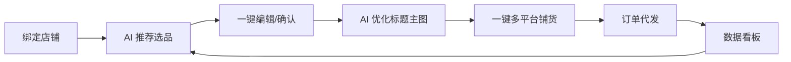

# MVP 产品需求文档（PRD）

> 版本：v0.1 · 6 周内交付 · 目标：服务市场上架 + 100 家试用商家

## 1. 目标用户

**主要目标**：抖音小店新手商家（开店 0–6 个月，无经验，白牌选品）
**次要目标**：淘系小卖家（铺货量 < 1000 SKU，希望降低人力）

## 2. 核心价值主张

> **"今天搬什么款，AI 替你选；标题主图详情，AI 替你做。"**

## 3. 用户旅程（核心闭环）

## 4. 功能模块（MVP 范围）

### 4.1 用户与店铺

| 编号 | 功能                             | 优先级 |
| ---- | -------------------------------- | ------ |
| U-01 | 手机号 + 微信扫码注册登录        | P0     |
| U-02 | 绑定 1688 采购账号（OAuth）      | P0     |
| U-03 | 绑定销售店铺（淘宝/抖店/拼多多） | P0     |
| U-04 | 多店铺管理与切换                 | P0     |
| U-05 | 团队子账号与权限（V1.1）         | P2     |

### 4.2 智能选品

| 编号 | 功能                           | 优先级 | 验收标准               |
| ---- | ------------------------------ | ------ | ---------------------- |
| S-01 | 1688 货源池索引（百万级 SKU）  | P0     | 数据日更，覆盖主流类目 |
| S-02 | "今日推荐 50 款"个性化榜单     | P0     | 推荐理由可解释         |
| S-03 | 多平台爆款雷达（抖音/小红书）  | P0     | 至少 3 个外部数据源    |
| S-04 | 选品打分卡（竞争度/利润/合规） | P0     | 5 维评分可视化         |
| S-05 | 收藏夹与对比工具               | P1     | 支持 5 个商品并排对比  |
| S-06 | 类目/价格带筛选                | P0     | 标准电商筛选 UI        |

### 4.3 AI 优化

| 编号  | 功能                        | 优先级 | 验收标准                 |
| ----- | --------------------------- | ------ | ------------------------ |
| AI-01 | AI 标题生成（按平台 SEO）   | P0     | 5 选 1，可一键替换       |
| AI-02 | AI 详情页文案重写           | P0     | 卖点结构化，3 段以上     |
| AI-03 | 主图水印检测与擦除          | P0     | 准确率 > 95%             |
| AI-04 | 主图背景替换/重绘           | P0     | 5 种风格模板             |
| AI-05 | 主图角标合成（包邮/优惠等） | P1     | 10 套模板可选            |
| AI-06 | 合规审核（极限词/医疗用语） | P0     | 命中拦截 + 替换建议      |
| AI-07 | 类目智能映射                | P0     | Top3 候选 + 准确率 > 90% |

### 4.4 一键铺货

| 编号 | 功能                               | 优先级 |
| ---- | ---------------------------------- | ------ |
| P-01 | 多平台同步铺货（淘宝/抖店/拼多多） | P0     |
| P-02 | 铺货任务队列与失败重试             | P0     |
| P-03 | 智能定价（竞品对标 + 反推保本价）  | P0     |
| P-04 | SKU 属性自动填充                   | P0     |
| P-05 | 库存联动（缺货自动下架）           | P1     |

### 4.5 订单代发

| 编号 | 功能                       | 优先级 |
| ---- | -------------------------- | ------ |
| O-01 | 订单同步（多店铺统一视图） | P0     |
| O-02 | 自动 1688 下单代发         | P0     |
| O-03 | 物流回传与状态同步         | P0     |
| O-04 | 异常订单告警（飞书/企微）  | P1     |
| O-05 | 售后工单（V1.1）           | P2     |

### 4.6 数据看板

| 编号 | 功能                     | 优先级 |
| ---- | ------------------------ | ------ |
| D-01 | 多店铺 GMV / 订单 / 利润 | P0     |
| D-02 | 热销榜与滞销榜           | P1     |
| D-03 | AI 经营周报（V1.1）      | P2     |

## 5. 非功能需求

| 维度   | 指标                                              |
| ------ | ------------------------------------------------- |
| 性能   | 选品列表 P95 < 800ms；铺货单条 < 30s              |
| 可用性 | 月度 SLA 99.5%                                    |
| 安全   | 数据传输 HTTPS；Token KMS 加密；通过等保 2.0 三级 |
| 合规   | 仅使用官方 OpenAPI；商品文案过敏感词库            |
| 成本   | 单店月 AI 调用成本 ≤ 订阅费 20%                   |

## 6. MVP 不做什么（明确边界）

- ❌ 微信小店、京东、视频号小店（V1.1+）
- ❌ AI 客服（V1.1）
- ❌ 视频生成（V1.2）
- ❌ ERP/进销存（永远不做）
- ❌ 浏览器插件（V1.1）
- ❌ 团队子账号（V1.1）

## 7. 验收标准（DoD）

- [ ] 注册 → 绑定店铺 → 选品 → 铺货 全链路打通
- [ ] AI 主图处理可用，违规率 < 1%
- [ ] 单店首批 100 个 SKU 铺货成功率 > 95%
- [ ] 服务市场审核通过并上架
- [ ] 至少 100 个真实商家试用 7 天

## 8. 关键指标（北极星）

- **激活率**：注册 → 完成首次铺货 ≥ 40%
- **留存**：W1 留存 ≥ 35%；M1 留存 ≥ 20%
- **付费转化**：试用 → 付费 ≥ 8%
- **NPS**：≥ 40
