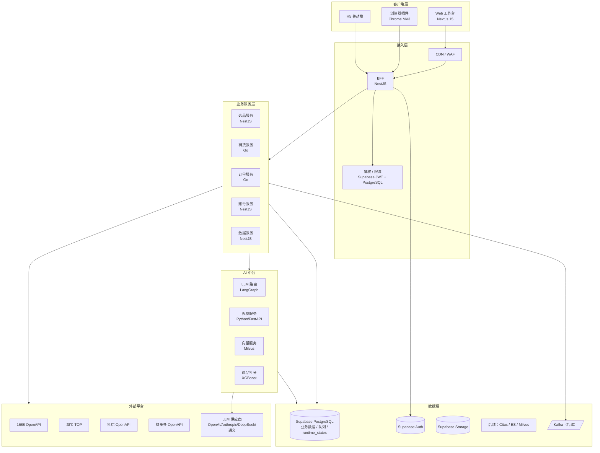
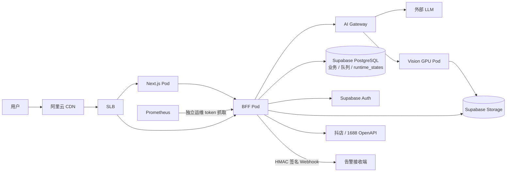

# 技术架构与选型

> 本文同时记录当前 MVP 与目标架构。当前候选形态是 Next.js Web + NestJS BFF 模块化单体、Supabase（PostgreSQL / Auth / Storage）、PostgreSQL 持久队列与 `runtime_states` 短期协调状态；staging / production 不再配置 `REDIS_URL`，本机也不运行 Redis。Go 微服务、Kafka、Temporal、Milvus、ClickHouse 与 K8s 属于后续演进，不能当作当前已上线能力。
>
> **状态边界（2026-08-10）**：Supabase staging 已在 2026-08-08 应用至 45/45；`d30d302` 的严格审计确认 pending 0、schema diff matched，42/42 public 表 RLS 与客户端表、sequence、default privileges 隔离均通过，真实备份恢复 43→45 演练也已通过。本机 BFF、Quick Tunnel 和外部固定 Gateway 的 `database + runtimeState` readiness 已验证；18/18 smoke 通过当前 Quick Tunnel BFF 与当前本地 Web 构建完成，runtime-state store/read/consume/lease/renew/release 通过。旧 Redis/Postgres 运行容器和运行卷已删除，保留未挂载的历史备份卷。真实 Auth 邮件、抖店/1688 E2E 与独立生产资源仍未完成，因此不能表述为生产可用。

## 1. 整体架构

## 2. 技术选型

### 2.1 前端

| 模块   | 选型                     | 理由                              |
| ------ | ------------------------ | --------------------------------- |
| 框架   | Next.js 15 (App Router)  | SSR + RSC，AI 流式输出友好        |
| 语言   | TypeScript 5.x           | 类型安全                          |
| UI 库  | shadcn/ui + Radix        | 可定制、无锁定                    |
| 样式   | Tailwind CSS 4           | 工程化、AI 生成友好               |
| 状态   | Zustand + TanStack Query | 轻量 + 服务端状态分离             |
| 表单   | React Hook Form + Zod    | 类型化 schema                     |
| 图表   | ECharts / Recharts       | ECharts 数据看板；Recharts 简单图 |
| 国际化 | next-intl                | 后续出海预留                      |

### 2.2 浏览器插件

| 模块 | 选型                           |
| ---- | ------------------------------ |
| 平台 | Chrome MV3                     |
| 构建 | Vite + CRXJS                   |
| UI   | React + Tailwind（共享 ui 包） |

### 2.3 后端

| 模块             | 选型                                             | 理由                                 |
| ---------------- | ------------------------------------------------ | ------------------------------------ |
| BFF / 业务主语言 | NestJS (TypeScript)                              | 与前端共享类型；生态成熟             |
| 高并发 IO        | Go (gin/fiber)                                   | 采集、订单代发场景                   |
| AI 视觉服务      | Python + FastAPI                                 | PyTorch / SAM / Diffusers 生态       |
| ORM              | Prisma（NestJS）/ GORM（Go）                     | 类型安全                             |
| RPC              | gRPC + Protobuf                                  | 内部服务通信                         |
| 队列             | PostgreSQL `publish_jobs`（当前）/ Kafka（后续） | 当前保证持久化认领、退避、死信与恢复 |
| 调度             | Nest worker（当前）/ Temporal（后续）            | 业务跨服务、跨小时后再引入 Temporal  |

### 2.4 AI 中台

| 模块       | 选型                                            |
| ---------- | ----------------------------------------------- |
| 编排       | LangGraph                                       |
| LLM 路由   | 自研 + Portkey/LiteLLM                          |
| 文本模型   | GPT-4o / Claude Sonnet / DeepSeek-V3 / Qwen-Max |
| 嵌入模型   | bge-m3 / text-embedding-3-small                 |
| 向量库     | Milvus 2.4                                      |
| 视觉抠图   | SAM2                                            |
| 视觉重绘   | Flux.1 / SDXL（自部署）/ 即梦/可灵 API          |
| 水印检测   | YOLO v10 自训练                                 |
| 多模态 VLM | Qwen-VL / GPT-4o-vision（合规审核）             |

### 2.5 数据层

| 模块     | 选型                                                      | 用途                                                                                      |
| -------- | --------------------------------------------------------- | ----------------------------------------------------------------------------------------- |
| 关系型   | Supabase / PostgreSQL 15+                                 | 业务主库、队列、计量与审计                                                                |
| 身份     | Supabase Auth                                             | 邮箱身份、JWT 与会话                                                                      |
| 短期状态 | Supabase PostgreSQL `runtime_states`（当前）              | OAuth state/result、Token 刷新恢复、订单/商品租约、1688 fixed-window limiter、AI 精确缓存 |
| 大表扩容 | Citus 分区 / 独立 PG 集群                                 | 货源亿级 SKU 时再切（MVP 不做）                                                           |
| 搜索     | Postgres `pg_trgm` + GIN（早期）→ Elasticsearch 8（后期） | 商品全文检索                                                                              |
| 向量     | Supabase `pgvector`（早期）→ Milvus 2.4（亿级）           | 选品语义、类目映射                                                                        |
| 对象存储 | Supabase Storage（当前）→ OSS / 七牛（按部署选择）        | 图片、视频                                                                                |
| 消息     | PostgreSQL 队列（当前）→ Kafka 3.x（跨服务后）            | 铺货任务与后续事件流                                                                      |
| 数仓     | PostgreSQL 聚合（当前）→ ClickHouse（数据量增长后）       | 经营分析、看板                                                                            |

### 2.6 基础设施

| 模块 | 当前仓库已落地                                             | 目标形态                               |
| ---- | ---------------------------------------------------------- | -------------------------------------- |
| 容器 | Docker 多阶段不可变 BFF/Web/migrate 镜像                   | K8s（阿里云 ACK）                      |
| CD   | migration-once、readiness 切流与回滚手册；尚未接目标云平台 | Argo CD + Helm                         |
| CI   | GitHub Actions 全量代码、镜像、migration、smoke 与退出门禁 | 保持                                   |
| IaC  | 尚未落地                                                   | Terraform                              |
| 监控 | health/operations 端点、Prometheus 文本、签名告警 Webhook  | OpenTelemetry + Grafana + Loki + Tempo |
| APM  | 尚未接入集中 APM                                           | Sentry / Tempo                         |
| 日志 | 进程结构化日志；尚未接入集中存储                           | SLS / Loki                             |

## 3. 部署拓扑

## 4. 关键技术决策

### 4.1 为什么 Monorepo？

- 前后端共享 TS 类型，提升开发效率
- 浏览器插件、Web、BFF 共享 UI 与工具包
- 工具：**pnpm workspaces + Turborepo**

### 4.2 为什么 NestJS + Go 双语言？

- NestJS：业务逻辑迭代快，类型与前端复用
- Go：1688 采集、订单代发是 IO 密集型，并发性能更好
- 边界清晰：业务逻辑 NestJS，高频 IO 与定时任务 Go

### 4.3 为什么自部署 + API 双轨视觉？

- API（即梦/可灵）：低 QPS 场景，零运维
- 自部署 Flux：高 QPS 场景成本可控（8 卡 A10 月成本约 3 万，单图 0.03 元）
- **路由策略**：用户付费等级 + 实时 QPS 决定走哪一路

### 4.4 为什么当前使用 PostgreSQL 持久队列，何时引入 Temporal？

- 当前铺货在单体内执行，`publish_jobs` 已提供原子认领、指数退避、死信、stale lock 恢复和人工重试，减少 MVP 运维面
- 当流程真正跨服务、跨小时并需要补偿事务与工作流版本化时再引入 Temporal
- 引入新调度系统前必须证明现有数据库队列成为容量或可靠性瓶颈，并完成迁移与双跑方案

### 4.5 为什么运行时状态也使用 Supabase PostgreSQL？

- 内测阶段优先减少独立中间件：BFF 只依赖同一个 Supabase 项目的 PostgreSQL / Auth / Storage，staging 和 production 都不需要 `REDIS_URL`
- `runtime_states` 以单条 SQL 完成一次性写入/消费、带 owner token 的租约与 fixed-window 计数，兼容 Supabase transaction pooler；过期记录有索引并由有界清理回收
- OAuth state/result、加密后的 Token refresh recovery、订单同步锁、商品变更锁、HTTP 变更请求限流、1688 全局限流与 AI 精确缓存共用该抽象；只读 HTTP 请求不额外写限流计数，AI 缓存故障时直接 miss，不保留进程内副本。业务持久事实、任务状态和审计仍保存于各自正式表
- readiness 同时检查最新必需 migration、数据库与 `runtime_states`；任一失败都返回 503。只有真实负载证明 PostgreSQL 协调成为瓶颈时，才评估新的托管服务并先完成容量、故障和迁移验证

## 5. 服务边界

| 服务       | 职责                          | 不做     |
| ---------- | ----------------------------- | -------- |
| account    | 用户、店铺授权、Token 管理    | 业务逻辑 |
| product    | 1688 货源、选品打分、向量检索 | 铺货执行 |
| publish    | 铺货编排、平台 API 适配       | 选品     |
| order      | 订单同步、代发、物流          | 商品     |
| ai-gateway | LLM 路由、Prompt 模板、缓存   | 业务逻辑 |
| vision     | 图像抠图/重绘/检测            | 文本     |
| analytics  | 看板、报表、AI 周报           | 实时业务 |

## 6. 演进路径

- **Phase 1**：单体 Monorepo，所有业务在 NestJS BFF 中以模块拆分
- **Phase 2**：拆出 Go 服务（采集、订单）和 Python 服务（视觉）
- **Phase 3**：按域拆分微服务，引入 Service Mesh
- **Phase 4**：多机房灾备、海外节点
