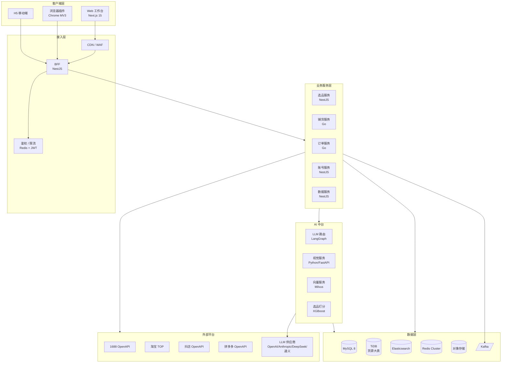
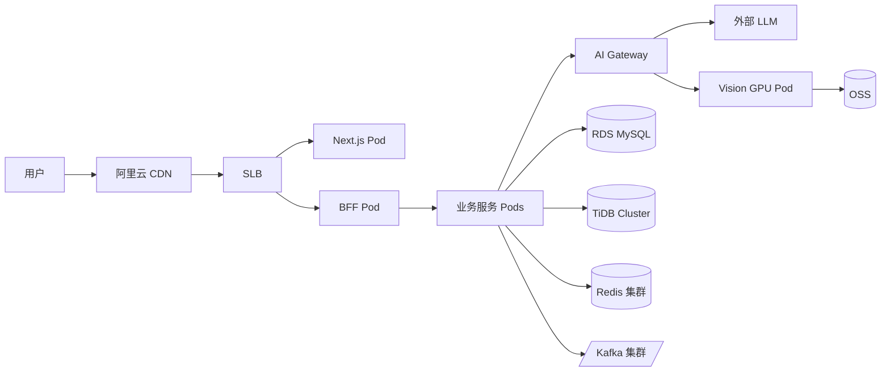

# 技术架构与选型

## 1. 整体架构

## 2. 技术选型

### 2.1 前端

| 模块 | 选型 | 理由 |
|---|---|---|
| 框架 | Next.js 15 (App Router) | SSR + RSC，AI 流式输出友好 |
| 语言 | TypeScript 5.x | 类型安全 |
| UI 库 | shadcn/ui + Radix | 可定制、无锁定 |
| 样式 | Tailwind CSS 4 | 工程化、AI 生成友好 |
| 状态 | Zustand + TanStack Query | 轻量 + 服务端状态分离 |
| 表单 | React Hook Form + Zod | 类型化 schema |
| 图表 | ECharts / Recharts | ECharts 数据看板；Recharts 简单图 |
| 国际化 | next-intl | 后续出海预留 |

### 2.2 浏览器插件

| 模块 | 选型 |
|---|---|
| 平台 | Chrome MV3 |
| 构建 | Vite + CRXJS |
| UI | React + Tailwind（共享 ui 包） |

### 2.3 后端

| 模块 | 选型 | 理由 |
|---|---|---|
| BFF / 业务主语言 | NestJS (TypeScript) | 与前端共享类型；生态成熟 |
| 高并发 IO | Go (gin/fiber) | 采集、订单代发场景 |
| AI 视觉服务 | Python + FastAPI | PyTorch / SAM / Diffusers 生态 |
| ORM | Prisma（NestJS）/ GORM（Go） | 类型安全 |
| RPC | gRPC + Protobuf | 内部服务通信 |
| 队列 | Kafka（事件流）+ BullMQ（异步任务） | Kafka 业务事件、BullMQ 简单任务 |
| 调度 | Temporal | 复杂工作流（铺货、订单） |

### 2.4 AI 中台

| 模块 | 选型 |
|---|---|
| 编排 | LangGraph |
| LLM 路由 | 自研 + Portkey/LiteLLM |
| 文本模型 | GPT-4o / Claude Sonnet / DeepSeek-V3 / Qwen-Max |
| 嵌入模型 | bge-m3 / text-embedding-3-small |
| 向量库 | Milvus 2.4 |
| 视觉抠图 | SAM2 |
| 视觉重绘 | Flux.1 / SDXL（自部署）/ 即梦/可灵 API |
| 水印检测 | YOLO v10 自训练 |
| 多模态 VLM | Qwen-VL / GPT-4o-vision（合规审核） |

### 2.5 数据层

| 模块 | 选型 | 用途 |
|---|---|---|
| 关系型 | Supabase / PostgreSQL 15 | 业务主库 + Auth + Storage + Realtime |
| 大表扩容 | Citus 分区 / 独立 PG 集群 | 货源亿级 SKU 时再切（MVP 不做） |
| 搜索 | Postgres `pg_trgm` + GIN（早期）→ Elasticsearch 8（后期） | 商品全文检索 |
| 向量 | Supabase `pgvector`（早期）→ Milvus 2.4（亿级） | 选品语义、类目映射 |
| 缓存 | Redis Cluster | 热点 SKU、会话、限流 |
| 对象存储 | 阿里云 OSS / 七牛 | 图片、视频 |
| 消息 | Kafka 3.x | 事件流 |
| 数仓 | ClickHouse | 经营分析、看板 |

### 2.6 基础设施

| 模块 | 选型 |
|---|---|
| 容器 | Docker + K8s（阿里云 ACK） |
| CD | Argo CD + Helm |
| CI | GitHub Actions |
| IaC | Terraform |
| 监控 | OpenTelemetry + Grafana + Loki + Tempo |
| APM | Sentry |
| 日志 | SLS / Loki |

## 3. 部署拓扑

## 4. 关键技术决策

### 4.1 为什么 Monorepo？

- 前后端共享 TS 类型，提升开发效率
- 浏览器插件、Web、BFF 共享 UI 与工具包
- 工具：**pnpm workspaces + Turborepo**

### 4.2 为什么 NestJS + Go 双语言？

- NestJS：业务逻辑迭代快，类型与前端复用
- Go：1688 采集、订单代发是 IO 密集型，并发性能更好
- 边界清晰：业务逻辑 NestJS，高频 IO 与定时任务 Go

### 4.3 为什么自部署 + API 双轨视觉？

- API（即梦/可灵）：低 QPS 场景，零运维
- 自部署 Flux：高 QPS 场景成本可控（8 卡 A10 月成本约 3 万，单图 0.03 元）
- **路由策略**：用户付费等级 + 实时 QPS 决定走哪一路

### 4.4 为什么 Temporal 而不是 BullMQ？

- 铺货任务 = 长时编排（采集→AI 处理→多平台铺货→失败重试），可能跨小时
- Temporal 提供持久化、可观测、版本化的工作流，BullMQ 只能做简单队列
- 简单异步任务仍用 BullMQ

## 5. 服务边界

| 服务 | 职责 | 不做 |
|---|---|---|
| account | 用户、店铺授权、Token 管理 | 业务逻辑 |
| product | 1688 货源、选品打分、向量检索 | 铺货执行 |
| publish | 铺货编排、平台 API 适配 | 选品 |
| order | 订单同步、代发、物流 | 商品 |
| ai-gateway | LLM 路由、Prompt 模板、缓存 | 业务逻辑 |
| vision | 图像抠图/重绘/检测 | 文本 |
| analytics | 看板、报表、AI 周报 | 实时业务 |

## 6. 演进路径

- **Phase 1**：单体 Monorepo，所有业务在 NestJS BFF 中以模块拆分
- **Phase 2**：拆出 Go 服务（采集、订单）和 Python 服务（视觉）
- **Phase 3**：按域拆分微服务，引入 Service Mesh
- **Phase 4**：多机房灾备、海外节点
