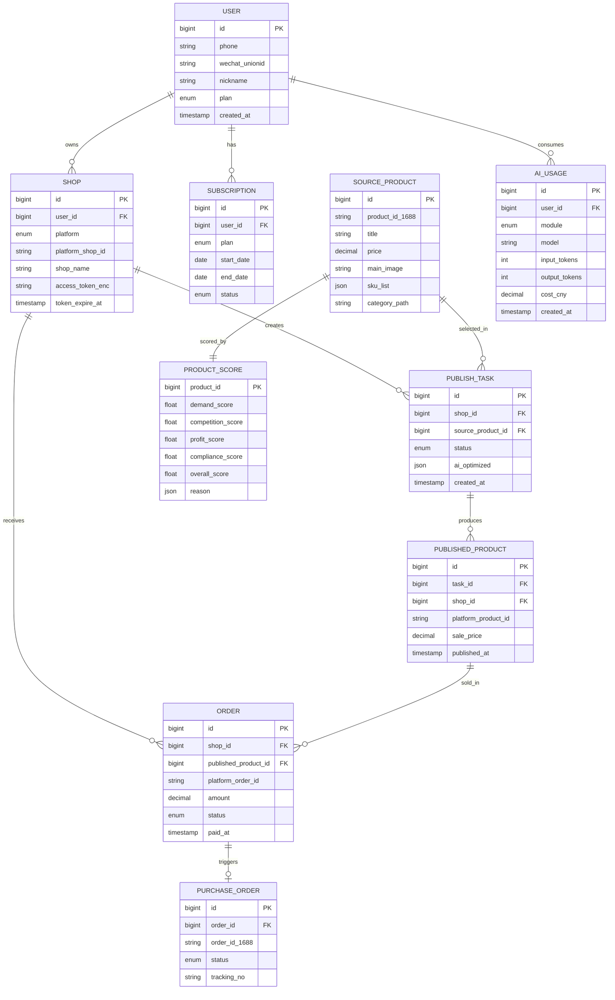

# 核心数据模型

> 数据库：Supabase / PostgreSQL 15（业务主库 + Auth + Storage）、Milvus（向量）、Redis（缓存）
> 货源大表（source_products）若达到亿级再考虑 Citus 分区或独立 PG 集群。

## 1. 实体关系（ER 概览）



## 2. 核心表 Schema（MySQL）

### 2.1 用户与店铺

```sql
-- 用户表
CREATE TABLE users (
  id            BIGINT PRIMARY KEY AUTO_INCREMENT,
  phone         VARCHAR(20)  UNIQUE,
  wechat_unionid VARCHAR(64) UNIQUE,
  nickname      VARCHAR(64),
  avatar_url    VARCHAR(512),
  plan          ENUM('free','basic','pro','flagship') DEFAULT 'free',
  status        ENUM('active','disabled') DEFAULT 'active',
  created_at    DATETIME DEFAULT CURRENT_TIMESTAMP,
  updated_at    DATETIME DEFAULT CURRENT_TIMESTAMP ON UPDATE CURRENT_TIMESTAMP,
  INDEX idx_plan (plan)
);

-- 店铺授权表（销售店铺 + 1688 采购账号）
CREATE TABLE shops (
  id              BIGINT PRIMARY KEY AUTO_INCREMENT,
  user_id         BIGINT NOT NULL,
  platform        ENUM('taobao','tmall','douyin','pdd','kuaishou','alibaba_buyer') NOT NULL,
  platform_shop_id VARCHAR(64) NOT NULL,
  shop_name       VARCHAR(128),
  role            ENUM('seller','buyer') NOT NULL DEFAULT 'seller',
  access_token_enc VARCHAR(1024),  -- KMS 加密
  refresh_token_enc VARCHAR(1024),
  token_expire_at DATETIME,
  status          ENUM('active','expired','revoked') DEFAULT 'active',
  created_at      DATETIME DEFAULT CURRENT_TIMESTAMP,
  UNIQUE KEY uk_user_platform_shop (user_id, platform, platform_shop_id),
  INDEX idx_user (user_id)
);
```

### 2.2 选品与货源

```sql
-- 1688 货源池（TiDB，亿级，分区按 category_l1）
CREATE TABLE source_products (
  id                 BIGINT PRIMARY KEY AUTO_INCREMENT,
  product_id_1688    VARCHAR(32) NOT NULL,
  supplier_id        VARCHAR(32),
  title              VARCHAR(255),
  price              DECIMAL(10,2),
  price_min          DECIMAL(10,2),
  price_max          DECIMAL(10,2),
  main_image         VARCHAR(512),
  detail_images      JSON,
  category_path      VARCHAR(255),
  category_l1        VARCHAR(64),
  category_l2        VARCHAR(64),
  sku_list           JSON,
  attributes         JSON,
  monthly_sold       INT DEFAULT 0,
  is_cross_border    BOOLEAN DEFAULT FALSE,
  is_one_piece_drop  BOOLEAN DEFAULT FALSE,  -- 是否支持一件代发
  raw_payload        JSON,
  synced_at          DATETIME,
  UNIQUE KEY uk_product_id (product_id_1688),
  INDEX idx_category_l1 (category_l1),
  INDEX idx_synced_at (synced_at)
) PARTITION BY HASH(id) PARTITIONS 16;

-- 选品打分
CREATE TABLE product_scores (
  product_id          BIGINT PRIMARY KEY,
  demand_score        FLOAT,    -- 需求度（外部爆款信号）
  competition_score   FLOAT,    -- 竞争度（同款数量）
  profit_score        FLOAT,    -- 利润空间
  compliance_score    FLOAT,    -- 合规风险（反向）
  trend_score         FLOAT,    -- 趋势热度
  overall_score       FLOAT,    -- 综合分
  reason              JSON,     -- LLM 生成的推荐理由
  features            JSON,     -- 模型特征快照
  scored_at           DATETIME,
  INDEX idx_overall (overall_score DESC)
);

-- 用户收藏夹
CREATE TABLE user_favorites (
  id                BIGINT PRIMARY KEY AUTO_INCREMENT,
  user_id           BIGINT NOT NULL,
  source_product_id BIGINT NOT NULL,
  folder_name       VARCHAR(64) DEFAULT 'default',
  created_at        DATETIME DEFAULT CURRENT_TIMESTAMP,
  UNIQUE KEY uk_user_product (user_id, source_product_id)
);
```

### 2.3 铺货与商品

```sql
-- 铺货任务（一个货源 → 多个目标店铺）
CREATE TABLE publish_tasks (
  id                BIGINT PRIMARY KEY AUTO_INCREMENT,
  user_id           BIGINT NOT NULL,
  source_product_id BIGINT NOT NULL,
  target_shop_ids   JSON,  -- [shop_id1, shop_id2]
  status            ENUM('pending','optimizing','publishing','partial','success','failed') DEFAULT 'pending',
  ai_optimized      JSON,  -- AI 处理后的标题、详情、主图等
  pricing_strategy  JSON,
  error_msg         TEXT,
  created_at        DATETIME DEFAULT CURRENT_TIMESTAMP,
  finished_at       DATETIME,
  INDEX idx_user_status (user_id, status)
);

-- 已铺货商品（每个目标店铺一条）
CREATE TABLE published_products (
  id                  BIGINT PRIMARY KEY AUTO_INCREMENT,
  task_id             BIGINT NOT NULL,
  shop_id             BIGINT NOT NULL,
  source_product_id   BIGINT NOT NULL,
  platform_product_id VARCHAR(64),
  title               VARCHAR(255),
  sale_price          DECIMAL(10,2),
  cost_price          DECIMAL(10,2),
  status              ENUM('online','offline','draft','rejected') DEFAULT 'online',
  category_id         VARCHAR(64),
  main_image          VARCHAR(512),
  published_at        DATETIME,
  INDEX idx_shop (shop_id),
  INDEX idx_platform_product (platform_product_id)
);
```

### 2.4 订单与代发

```sql
-- 销售订单
CREATE TABLE orders (
  id                    BIGINT PRIMARY KEY AUTO_INCREMENT,
  shop_id               BIGINT NOT NULL,
  published_product_id  BIGINT,
  platform_order_id     VARCHAR(64) NOT NULL,
  buyer_nick            VARCHAR(64),
  receiver_name         VARCHAR(64),
  receiver_phone_enc    VARCHAR(256),  -- 加密
  receiver_address_enc  TEXT,
  sku_info              JSON,
  amount                DECIMAL(10,2),
  status                ENUM('paid','purchasing','shipped','received','refunded','closed'),
  paid_at               DATETIME,
  UNIQUE KEY uk_platform_order (shop_id, platform_order_id),
  INDEX idx_status (status)
);

-- 1688 代发采购单
CREATE TABLE purchase_orders (
  id              BIGINT PRIMARY KEY AUTO_INCREMENT,
  order_id        BIGINT NOT NULL,
  order_id_1688   VARCHAR(64),
  status          ENUM('pending','placed','shipped','received','failed'),
  tracking_no     VARCHAR(64),
  carrier         VARCHAR(32),
  failure_reason  TEXT,
  retry_count     INT DEFAULT 0,
  created_at      DATETIME DEFAULT CURRENT_TIMESTAMP,
  INDEX idx_order (order_id),
  INDEX idx_status (status)
);
```

### 2.5 AI 使用与计费

```sql
-- AI 调用流水（成本核算 + 风控）
CREATE TABLE ai_usage_logs (
  id              BIGINT PRIMARY KEY AUTO_INCREMENT,
  user_id         BIGINT NOT NULL,
  module          ENUM('title','detail','image_remove','image_relight','category','compliance','customer_service'),
  model           VARCHAR(64),
  input_tokens    INT DEFAULT 0,
  output_tokens   INT DEFAULT 0,
  image_count     INT DEFAULT 0,
  cost_cny        DECIMAL(10,4),
  trace_id        VARCHAR(64),
  created_at      DATETIME DEFAULT CURRENT_TIMESTAMP,
  INDEX idx_user_created (user_id, created_at),
  INDEX idx_module (module)
);

-- 订阅
CREATE TABLE subscriptions (
  id          BIGINT PRIMARY KEY AUTO_INCREMENT,
  user_id     BIGINT NOT NULL,
  plan        ENUM('basic','pro','flagship') NOT NULL,
  start_date  DATE NOT NULL,
  end_date    DATE NOT NULL,
  amount_cny  DECIMAL(10,2),
  status      ENUM('active','expired','cancelled') DEFAULT 'active',
  created_at  DATETIME DEFAULT CURRENT_TIMESTAMP,
  INDEX idx_user (user_id),
  INDEX idx_end_date (end_date)
);
```

## 3. 向量库（Milvus）

| Collection | 维度 | 用途 |
|---|---|---|
| `product_embeddings` | 1024 (bge-m3) | 选品语义检索、相似款 |
| `category_embeddings` | 1024 | 类目映射 |
| `image_embeddings` | 768 (CLIP) | 主图相似搜索 |

**Schema 示例**：

```python
{
  "id": int64,
  "product_id": int64,
  "platform": "1688|taobao|douyin|...",
  "title_vector": float[1024],
  "image_vector": float[768],
  "category_l1": str,
  "price": float,
  "synced_at": int64
}
```

## 4. 数据流（关键事件）

| 事件 | 来源 | 消费方 |
|---|---|---|
| `source.product.synced` | 采集 Worker | product 服务（写库 + 触发打分） |
| `score.updated` | 打分 Worker | 看板缓存刷新 |
| `publish.task.created` | publish 服务 | Temporal Workflow |
| `publish.task.finished` | Temporal | 通知 + 看板 |
| `order.paid` | 平台 Webhook | order 服务 |
| `purchase.placed` | order 服务 | 1688 代发 |
| `ai.usage.recorded` | ai-gateway | 计费 + 限流 |

## 5. 缓存策略

| Key 模式 | 用途 | TTL |
|---|---|---|
| `product:{id}` | 货源详情 | 1h |
| `score:top:{cat}:{date}` | 类目每日推荐 | 24h |
| `shop:token:{shop_id}` | OAuth Token | 提前 5min 过期刷新 |
| `ratelimit:user:{id}:{module}` | AI 限流 | 滑动窗口 |
| `compliance:words` | 敏感词库 | 24h |

## 6. 数据合规

- **手机号、地址**：AES-256-GCM 加密；KMS 管理密钥
- **OAuth Token**：信封加密；定期轮换
- **审计日志**：写入独立库，留存 6 个月
- **数据删除**：用户注销 30 天后物理删除（GDPR/个保法）
