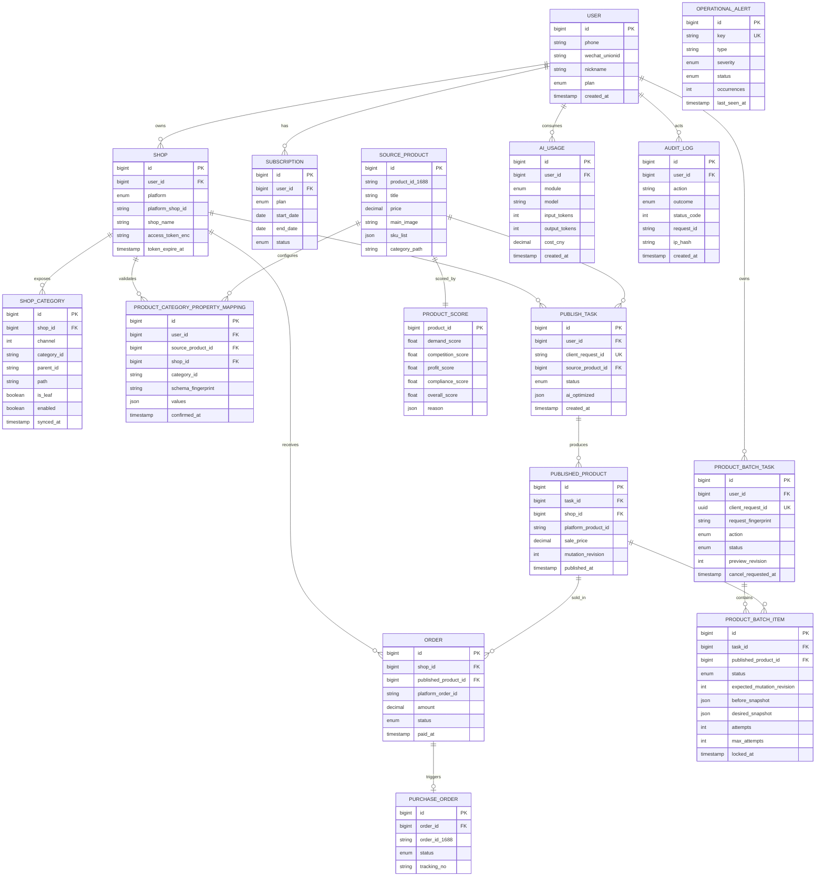

# 核心数据模型

> 当前数据层：Supabase / PostgreSQL 15（业务主库 + Auth + Storage）、Redis（缓存与锁）；Milvus 为后续向量规模化选项。
> 货源大表（source_products）若达到亿级再考虑 Citus 分区或独立 PG 集群。

> **权威说明**：当前可执行数据库定义以 `packages/db/prisma/schema.prisma` 和 `packages/db/prisma/migrations/` 为准。下方 MySQL DDL 是早期容量设计草案，不能用于当前环境建库、迁移或 schema diff。

## 1. 实体关系（ER 概览）



## 2. 当前铺货草稿契约

`publish_drafts` 是当前 PostgreSQL/Prisma 模型的一部分，每个用户最多一条，用于保存可恢复的铺货意图：货源、目标店铺、定价策略和 AI 选项。它不保存利润试算凭证、预检结果、平台规则快照或发布结果；恢复后必须重新试算和预检。

- `revision` 与 `client_request_id` 共同构成写入 generation；更新、删除都必须同时匹配，避免草稿删除重建后 revision 回到 1 造成 ABA 覆盖。
- 内容不变的保存会锁定并返回原 generation；内容变化时 revision 递增且轮换 `client_request_id`。
- 正式创建铺货任务时，任务、队列 job 与草稿消费处于同一事务；请求必须精确匹配草稿 generation 和 payload。
- 表启用 RLS，并撤销 `anon` / `authenticated` 直接权限；业务读写只经过已认证 BFF。

权威定义见 `packages/db/prisma/schema.prisma` 的 `PublishDraft` 和 migration `20260804023000_add_publish_drafts`。

## 3. 当前批量商品操作契约

`product_batch_tasks` 与 `product_batch_items` 是 R2-02 的 item 级持久执行模型。当前应用层允许 `offline`（批量下架）、`edit_title`（批量改标题）、`edit_price`（批量改价）与 `sync_inventory`（同步并核验 1688 库存）；数据库 action enum 中的上架、换源和清理仍只是预留值，不表示这些动作已经实现。

### 3.1 `product_batch_tasks`

- `user_id + client_request_id` 唯一；`request_fingerprint` 同时绑定动作、与顺序无关的商品集合、逐商品标题目标或规范化改价规则。同键同参返回原预览，同键异参拒绝，避免响应丢失后创建第二批任务或以旧请求键执行不同变更。
- `preview_revision` 绑定用户确认时看到的物化预览；只有匹配当前 revision 才能从 `preview` 进入 `queued`。
- `state_revision` 为任务状态 CAS 版本。确认、停止、重试、领取和汇总都会递增；并发汇总失去版本后必须重读 item，不能把已经完成的任务写回运行中。
- 状态为 `preview / queued / running / cancelling / cancelled / partial / succeeded / failed`。停止请求写入 `cancel_requested_at`，只阻止尚未开始或等待重试的条目；已经在执行的条目按协作式停止语义收敛。
- 任务按用户隔离查询；任务汇总从 item 状态派生，不能用整批重试覆盖逐项事实。worker 周期性对账“任务仍活跃但 item 已全部终态”的崩溃窗口，并用 `state_revision` CAS 收敛终态。

### 3.2 `product_batch_items`

- 每个任务与已发布商品组合唯一，最多由 API 创建 100 项；`ordinal` 保留预览顺序。
- `expected_mutation_revision`、`before_snapshot` 和 `desired_snapshot` 固化预览时事实。改价预览会把比例或逐项目标价物化为每个外部 SKU 的绝对整数分价格，重试只执行该快照，不按后来价格重新计算。执行前必须确认商品 revision、平台商品 ID、店铺和状态未漂移，否则 fail-closed 并要求新建预览。
- 库存预览保存已确认平台快照、1688 逐 SKU 目标、货源指纹和版本；执行前后回读平台，只提交未达目标 SKU。最终写入同时绑定商品 revision 与源库存版本，不能覆盖后来到达的新目标。
- 标题预览保存原标题、逐商品目标标题与预期商品 revision。平台写入前先保存 `TITLE_WRITE_STARTED` 与开始时间；平台超时、锁/worker 所有权丢失、取消竞态或响应畸形时收敛为不可重放的 `TITLE_RESULT_UNKNOWN`，只有核验平台标题后才能继续。目标标题、原标题、第三方标题和驳回/封禁状态分别按明确规则原子同步商品与 item。
- 状态为 `pending / running / retry_wait / succeeded / failed / skipped / cancelled`。worker 以旧状态、attempts 和任务取消状态做 CAS 领取，并记录 `locked_at / locked_by`；超过 5 分钟的 running 项按次数恢复为等待重试或失败。
- 失败重试只把选中的 `failed` 项重置为 `pending`；`succeeded` 与 `skipped` 不会重新执行。`result` 保存平台确认/恢复原因，错误码与脱敏信息按 item 保留。

### 3.3 `published_products.mutation_revision`

- 每次可能改变平台商品事实的本地成功写入递增 `mutation_revision`；批量执行使用预览值做条件更新，阻止旧预览覆盖后来的人工修正、状态同步或库存任务。
- 人工修正和平台状态同步在取得共享 Redis 商品锁后必须重读商品，并在最终写入时再次按 `mutation_revision` CAS；等待锁期间形成的旧快照不能复活已下架商品。
- `(shop_id, platform_product_id)` 在非空平台商品 ID 上保持唯一，既支撑稳定锁域，也在 migration 前显式阻断历史重复绑定。

### 3.4 `published_products.sku_price_snapshot`

- `sku_price_snapshot` 使用 `{ version: 1, items: [{ sourceSkuId, priceCents }] }` 保存最近一次已确认的平台 SKU 价格；SKU ID 唯一且稳定排序，价格为正整数分。`price_synced_at` 记录该快照最近与平台确认的时间。
- 新发布商品从发布 SKU 固化初始价格。批量改价执行前后都通过平台详情回读；平台价格若已是目标值则恢复成功，若只有部分 SKU 已更新则只续跑剩余项，若出现预览快照之外的价格或 SKU 集合变化则先同步真实价格、递增 `mutation_revision` 并要求新预览。
- 后续标题或详情编辑必须先回读平台价格并将最新快照重新注入完整商品编辑请求，避免 `product.editV2` 用旧发布价格覆盖独立改价结果。

### 3.5 `published_products.sku_inventory_snapshot`

- `sku_inventory_snapshot` 使用 `{ version: 1, items: [{ sourceSkuId, stock }] }` 保存最近一次平台回读的逐 SKU 绝对库存；SKU ID 唯一、稳定排序，库存必须是非负安全整数。
- 新发布或恢复的商品必须先回读平台库存；请求值与平台值不一致时保存平台事实并进入待同步，不能直接标记 `synced`。完整 `product.editV2` 前后也必须回读并保留当前平台库存，避免标题或详情修改覆盖独立库存变化。
- 自动库存 worker 与批量库存任务都按回读结果只续跑未达目标 SKU；只有全部 SKU 与 1688 目标一致才更新 `inventoryFingerprint/version` 和成功状态。源版本在平台 I/O 期间变化时，最终条件写入失败并保留新目标。

两张批量表均启用 RLS，并撤销 `anon` / `authenticated` 对表和 sequence 的直接权限。权威定义见 `packages/db/prisma/schema.prisma` 的 `ProductBatchTask`、`ProductBatchItem`、`PublishedProduct.mutationRevision`、`PublishedProduct.skuPriceSnapshot`、`PublishedProduct.skuInventorySnapshot`，以及 migration `20260804050000_add_product_batch_operations`、`20260804120000_add_published_product_price_snapshot` 与 `20260804183000_add_published_product_inventory_snapshot`。三条 migration 均尚未应用到 staging。

## 4. 核心表 Schema（历史 MySQL 设计草案）

本节仅保留早期字段和容量规划背景。当前应用使用 PostgreSQL、Prisma snake_case 映射和正式 migration；字段、enum、索引、外键与默认值必须从权威 schema 读取。

### 4.1 用户与店铺

```sql
-- 用户表
CREATE TABLE users (
  id            BIGINT PRIMARY KEY AUTO_INCREMENT,
  phone         VARCHAR(20)  UNIQUE,
  wechat_unionid VARCHAR(64) UNIQUE,
  nickname      VARCHAR(64),
  avatar_url    VARCHAR(512),
  plan          ENUM('free','basic','pro','flagship') DEFAULT 'free',
  status        ENUM('active','disabled') DEFAULT 'active',
  created_at    DATETIME DEFAULT CURRENT_TIMESTAMP,
  updated_at    DATETIME DEFAULT CURRENT_TIMESTAMP ON UPDATE CURRENT_TIMESTAMP,
  INDEX idx_plan (plan)
);

-- 店铺授权表（销售店铺 + 1688 采购账号）
CREATE TABLE shops (
  id              BIGINT PRIMARY KEY AUTO_INCREMENT,
  user_id         BIGINT NOT NULL,
  platform        ENUM('taobao','tmall','douyin','pdd','kuaishou','alibaba_buyer') NOT NULL,
  platform_shop_id VARCHAR(64) NOT NULL,
  shop_name       VARCHAR(128),
  role            ENUM('seller','buyer') NOT NULL DEFAULT 'seller',
  access_token_enc VARCHAR(1024),  -- KMS 加密
  refresh_token_enc VARCHAR(1024),
  token_expire_at DATETIME,
  status          ENUM('active','expired','revoked') DEFAULT 'active',
  created_at      DATETIME DEFAULT CURRENT_TIMESTAMP,
  UNIQUE KEY uk_user_platform_shop (user_id, platform, platform_shop_id),
  INDEX idx_user (user_id)
);
```

### 4.2 选品与货源

```sql
-- 1688 货源池（TiDB，亿级，分区按 category_l1）
CREATE TABLE source_products (
  id                 BIGINT PRIMARY KEY AUTO_INCREMENT,
  product_id_1688    VARCHAR(32) NOT NULL,
  supplier_id        VARCHAR(32),
  title              VARCHAR(255),
  price              DECIMAL(10,2),
  price_min          DECIMAL(10,2),
  price_max          DECIMAL(10,2),
  main_image         VARCHAR(512),
  detail_images      JSON,
  category_path      VARCHAR(255),
  category_l1        VARCHAR(64),
  category_l2        VARCHAR(64),
  sku_list           JSON,
  attributes         JSON,
  monthly_sold       INT DEFAULT 0,
  is_cross_border    BOOLEAN DEFAULT FALSE,
  is_one_piece_drop  BOOLEAN DEFAULT FALSE,  -- 是否支持一件代发
  raw_payload        JSON,
  synced_at          DATETIME,
  UNIQUE KEY uk_product_id (product_id_1688),
  INDEX idx_category_l1 (category_l1),
  INDEX idx_synced_at (synced_at)
) PARTITION BY HASH(id) PARTITIONS 16;

-- 选品打分
CREATE TABLE product_scores (
  product_id          BIGINT PRIMARY KEY,
  demand_score        FLOAT,    -- 需求度（外部爆款信号）
  competition_score   FLOAT,    -- 竞争度（同款数量）
  profit_score        FLOAT,    -- 利润空间
  compliance_score    FLOAT,    -- 合规风险（反向）
  trend_score         FLOAT,    -- 趋势热度
  overall_score       FLOAT,    -- 综合分
  reason              JSON,     -- LLM 生成的推荐理由
  features            JSON,     -- 模型特征快照
  scored_at           DATETIME,
  INDEX idx_overall (overall_score DESC)
);

-- 用户收藏夹
CREATE TABLE user_favorites (
  id                BIGINT PRIMARY KEY AUTO_INCREMENT,
  user_id           BIGINT NOT NULL,
  source_product_id BIGINT NOT NULL,
  folder_name       VARCHAR(64) DEFAULT 'default',
  created_at        DATETIME DEFAULT CURRENT_TIMESTAMP,
  UNIQUE KEY uk_user_product (user_id, source_product_id)
);
```

### 4.3 铺货与商品

```sql
-- 铺货任务（一个货源 → 多个目标店铺）
CREATE TABLE publish_tasks (
  id                BIGINT PRIMARY KEY AUTO_INCREMENT,
  user_id           BIGINT NOT NULL,
  client_request_id CHAR(36), -- 当前 PostgreSQL 为 UUID；同一用户内唯一，用于结果未知时恢复原任务
  source_product_id BIGINT NOT NULL,
  target_shop_ids   JSON,  -- [shop_id1, shop_id2]
  status            ENUM('pending','optimizing','publishing','partial','success','failed') DEFAULT 'pending',
  ai_optimized      JSON,  -- AI 处理后的标题、详情、主图等
  pricing_strategy  JSON,
  sku_snapshot      JSON,  -- 入队时固化的平台 SKU 规格、价格和库存
  category_property_snapshot JSON,       -- 入队时固化的类目属性
  category_qualification_snapshot JSON,  -- 入队时固化的类目资质 quality_list
  error_msg         TEXT,
  created_at        DATETIME DEFAULT CURRENT_TIMESTAMP,
  finished_at       DATETIME,
  UNIQUE KEY uk_user_client_request (user_id, client_request_id),
  INDEX idx_user_status (user_id, status)
);

-- 已铺货商品（每个目标店铺一条）
CREATE TABLE published_products (
  id                  BIGINT PRIMARY KEY AUTO_INCREMENT,
  task_id             BIGINT NOT NULL,
  shop_id             BIGINT NOT NULL,
  source_product_id   BIGINT NOT NULL,
  platform_product_id VARCHAR(64),
  title               VARCHAR(255),
  sale_price          DECIMAL(10,2),
  cost_price          DECIMAL(10,2),
  status              ENUM('online','offline','draft','rejected') DEFAULT 'online',
  category_id         VARCHAR(64),
  main_image          VARCHAR(512),
  edit_attempts       INT DEFAULT 0,
  last_edit_attempt_at DATETIME,
  last_edited_at      DATETIME,
  last_edit_error     TEXT,
  published_at        DATETIME,
  INDEX idx_shop (shop_id),
  INDEX idx_platform_product (platform_product_id)
);
```

### 4.4 订单与代发

```sql
-- 销售订单
CREATE TABLE orders (
  id                    BIGINT PRIMARY KEY AUTO_INCREMENT,
  shop_id               BIGINT NOT NULL,
  published_product_id  BIGINT,
  platform_order_id     VARCHAR(64) NOT NULL,
  buyer_nick            VARCHAR(64),
  receiver_name         VARCHAR(64),
  receiver_phone_enc    VARCHAR(256),  -- 加密
  receiver_address_enc  TEXT,
  sku_info              JSON,
  amount                DECIMAL(10,2),
  status                ENUM('paid','purchasing','shipped','received','refunded','closed'),
  after_sale_status     ENUM('none','pending','partial_refund','refunded','failed'),
  partial_refund_fingerprint VARCHAR(64),
  refund_amount         DECIMAL(10,2),      -- 平台未返回实际退款金额时由运营核对
  refund_amount_fingerprint VARCHAR(64),    -- 绑定当前子单售后状态/类型/退款结果
  refund_amount_confirmed_at DATETIME,
  refund_amount_note    TEXT,
  paid_at               DATETIME,
  UNIQUE KEY uk_platform_order (shop_id, platform_order_id),
  INDEX idx_status (status)
);

-- 1688 代发采购单
CREATE TABLE purchase_orders (
  id              BIGINT PRIMARY KEY AUTO_INCREMENT,
  order_id        BIGINT NOT NULL,
  order_id_1688   VARCHAR(64),
  purchase_cost   DECIMAL(10,2),       -- 采购原始/远端总金额
  reconciled_cost DECIMAL(10,2),       -- 退款或关闭后最终实际承担成本
  status          ENUM('pending','placed','shipped','received','failed'),
  tracking_no     VARCHAR(64),
  carrier         VARCHAR(64),
  failure_reason  TEXT,
  retry_count     INT DEFAULT 0,
  attempt_no      INT DEFAULT 1,
  prior_incurred_cost DECIMAL(10,2) DEFAULT 0,
  retry_eligible  BOOLEAN DEFAULT FALSE,
  ever_shipped    BOOLEAN DEFAULT FALSE,
  exception_revision INT DEFAULT 0,   -- 售后/关闭事件修订号，防止旧人工核销覆盖新事件
  created_at      DATETIME DEFAULT CURRENT_TIMESTAMP,
  INDEX idx_order (order_id),
  INDEX idx_status (status)
);

-- 被 1688 取消/关闭后已归档的采购尝试；保留远端单号与本次实际成本
CREATE TABLE purchase_order_attempts (
  id                BIGINT PRIMARY KEY AUTO_INCREMENT,
  purchase_order_id BIGINT NOT NULL,
  attempt_no        INT NOT NULL,
  out_order_id      VARCHAR(128) NOT NULL UNIQUE,
  order_id_1688     VARCHAR(64) NOT NULL,
  actual_cost       DECIMAL(10,2) NOT NULL,
  resolution_note   TEXT NOT NULL,
  started_at        DATETIME NOT NULL,
  resolved_at       DATETIME NOT NULL,
  UNIQUE KEY uk_purchase_attempt_no (purchase_order_id, attempt_no)
);

-- 发货后异常处理记录；旧包裹在清空前连同操作人和说明完整归档
CREATE TABLE purchase_order_recoveries (
  id                 BIGINT PRIMARY KEY AUTO_INCREMENT,
  purchase_order_id  BIGINT NOT NULL,
  operator_user_id   BIGINT NOT NULL,
  exception_revision INT NOT NULL,
  order_id_1688      VARCHAR(64) NOT NULL,
  previous_shipments JSON NOT NULL,
  note               TEXT NOT NULL,
  created_at         DATETIME DEFAULT CURRENT_TIMESTAMP
);
```

### 4.5 AI 使用与计费

```sql
-- AI 调用流水（成本核算 + 风控）
CREATE TABLE ai_usage_logs (
  id              BIGINT PRIMARY KEY AUTO_INCREMENT,
  user_id         BIGINT NOT NULL,
  module          ENUM('title','detail','image_remove','image_relight','category','compliance','customer_service'),
  model           VARCHAR(64),
  input_tokens    INT DEFAULT 0,
  output_tokens   INT DEFAULT 0,
  image_count     INT DEFAULT 0,
  cost_cny        DECIMAL(10,4),
  trace_id        VARCHAR(64),
  created_at      DATETIME DEFAULT CURRENT_TIMESTAMP,
  INDEX idx_user_created (user_id, created_at),
  INDEX idx_module (module)
);

-- 订阅
CREATE TABLE subscriptions (
  id          BIGINT PRIMARY KEY AUTO_INCREMENT,
  user_id     BIGINT NOT NULL,
  plan        ENUM('basic','pro','flagship') NOT NULL,
  start_date  DATE NOT NULL,
  end_date    DATE NOT NULL,
  amount_cny  DECIMAL(10,2),
  status      ENUM('active','expired','cancelled') DEFAULT 'active',
  created_at  DATETIME DEFAULT CURRENT_TIMESTAMP,
  INDEX idx_user (user_id),
  INDEX idx_end_date (end_date)
);
```

## 5. 当前审计与告警模型（PostgreSQL / Prisma）

### 5.1 `audit_logs`

| 字段组       | 当前定义                                                                                    |
| ------------ | ------------------------------------------------------------------------------------------- |
| 主体与动作   | `user_id` 可空并关联 `users`（删除用户时 `SetNull`）；`action`、`method`、`route`、资源标识 |
| 结果与追踪   | `outcome=success/failure`、`status_code`、`request_id`、`duration_ms`                       |
| 最小化上下文 | `ip_hash` 仅保存 HMAC、截断后的 `user_agent`、经过白名单控制的 `metadata`、`created_at`     |
| 查询索引     | 用户+时间、动作+时间、结果+时间、request ID                                                 |

审计覆盖写操作、失败鉴权和 OAuth 流程。禁止写入请求 body、Authorization、Cookie、明文 token、密钥或原始 IP。租户审计 API 只能读取当前用户的数据；运维汇总只暴露必要计数。`AuditRetentionService` 默认删除 180 天前记录，可通过 `AUDIT_RETENTION_DAYS` 调整。

### 5.2 `operational_alerts`

| 字段组     | 当前定义                                                                  |
| ---------- | ------------------------------------------------------------------------- |
| 唯一身份   | `key` 唯一；`type` 区分 dependency、queue、http、credential 等类别        |
| 状态       | `severity=warning/critical`、`status=active/resolved`                     |
| 生命周期   | `occurrences`、首次/最后发现、最后通知、恢复、创建与更新时间              |
| 内容与索引 | 脱敏 `summary/details`；按状态+严重度+最后发现时间及类型+最后发现时间查询 |

告警记录支持同 key 去重、严重度升级、重通知窗口和条件消失后的自动 resolved。通知 Webhook 使用 timestamp + HMAC-SHA256；数据库记录是状态源，外部通知失败不能导致告警状态丢失。

## 6. 向量库（Milvus）

| Collection            | 维度          | 用途                 |
| --------------------- | ------------- | -------------------- |
| `product_embeddings`  | 1024 (bge-m3) | 选品语义检索、相似款 |
| `category_embeddings` | 1024          | 类目映射             |
| `image_embeddings`    | 768 (CLIP)    | 主图相似搜索         |

**Schema 示例**：

```python
{
  "id": int64,
  "product_id": int64,
  "platform": "1688|taobao|douyin|...",
  "title_vector": float[1024],
  "image_vector": float[768],
  "category_l1": str,
  "price": float,
  "synced_at": int64
}
```

## 7. 数据流（关键事件）

| 事件                    | 来源         | 消费方                                  |
| ----------------------- | ------------ | --------------------------------------- |
| `source.product.synced` | 采集 Worker  | product 服务（写库 + 触发打分）         |
| `score.updated`         | 打分 Worker  | 看板缓存刷新                            |
| `publish.job.queued`    | publish API  | PostgreSQL `publish_jobs` + Nest worker |
| `publish.job.finished`  | Nest worker  | 铺货记录、审计、告警与看板              |
| `order.paid`            | 平台 Webhook | order 服务                              |
| `purchase.placed`       | order 服务   | 1688 代发                               |
| `ai.usage.recorded`     | ai-gateway   | 计费 + 限流                             |

## 8. 缓存策略

| Key 模式                       | 用途         | TTL                |
| ------------------------------ | ------------ | ------------------ |
| `product:{id}`                 | 货源详情     | 1h                 |
| `score:top:{cat}:{date}`       | 类目每日推荐 | 24h                |
| `shop:token:{shop_id}`         | OAuth Token  | 提前 5min 过期刷新 |
| `ratelimit:user:{id}:{module}` | AI 限流      | 滑动窗口           |
| `compliance:words`             | 敏感词库     | 24h                |

## 9. 数据合规

- **手机号、地址**：当前使用 AES-256-GCM；生产密钥必须由 Secret Manager/KMS 注入和轮换
- **OAuth Token**：当前加密落库、仅在调用时解密；生产环境须完成密钥轮换演练
- **审计日志**：写入专用 `audit_logs` 表，默认留存 180 天，不保存请求体、凭证或原始 IP
- **数据删除**：用户注销后删除/匿名化的期限和范围仍须法务确认并实现自动化，当前不得宣称已完成 GDPR/个保法注销闭环
