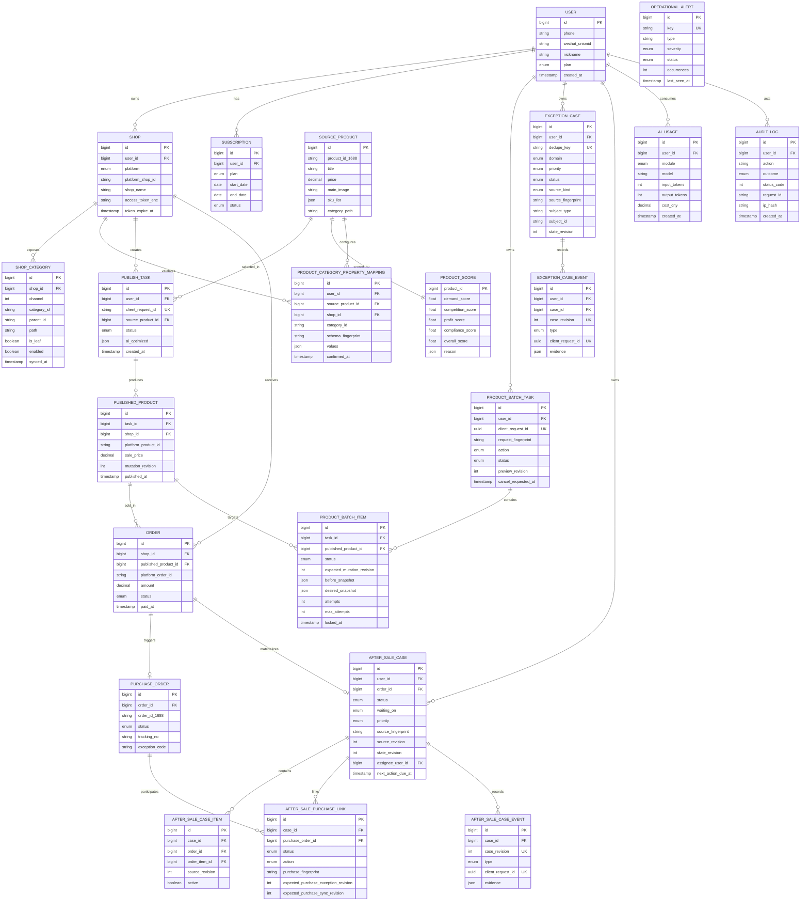

# 核心数据模型

> 当前数据层：Supabase / PostgreSQL 17.6（业务主库、持久队列与 `runtime_states`）+ Supabase Auth + Supabase Storage；staging / production 不再依赖 Redis，本机旧 Redis/Postgres 运行容器和运行卷已删除，保留未挂载的历史备份卷。Milvus 为后续向量规模化选项。
> 货源大表（source_products）若达到亿级再考虑 Citus 分区或独立 PG 集群。

> **权威说明**：当前可执行数据库定义以 `packages/db/prisma/schema.prisma` 和 `packages/db/prisma/migrations/` 为准。下方 MySQL DDL 是早期容量设计草案，不能用于当前环境建库、迁移或 schema diff。

> **2026-08-10 当前状态**：保留 2026-08-06 的 43/43 阶段证据；Supabase staging 已在 2026-08-08 应用至 **45/45**，当前 `d30d302` 的严格审计确认 pending 0、schema diff matched。42/42 public 表均启用 RLS，`anon` / `authenticated` 的表、sequence 与 default privileges 均为 0；真实一致性备份的隔离 43→45 恢复演练和 SKU/runtime-state 专用断言已通过。真实 Auth 邮件、抖店/1688、LLM、图片服务 E2E 与独立生产资源仍未完成，不能据此宣称生产可用。

## 1. 实体关系（ER 概览）



## 2. 当前铺货草稿契约

`publish_drafts` 是当前 PostgreSQL/Prisma 模型的一部分，每个用户最多一条，用于保存可恢复的铺货意图：货源、目标店铺、定价策略和 AI 选项。它不保存利润试算凭证、预检结果、平台规则快照或发布结果；恢复后必须重新试算和预检。

- `revision` 与 `client_request_id` 共同构成写入 generation；更新、删除都必须同时匹配，避免草稿删除重建后 revision 回到 1 造成 ABA 覆盖。
- 内容不变的保存会锁定并返回原 generation；内容变化时 revision 递增且轮换 `client_request_id`。
- 正式创建铺货任务时，任务、队列 job 与草稿消费处于同一事务；请求必须精确匹配草稿 generation 和 payload。
- 表启用 RLS，并撤销 `anon` / `authenticated` 直接权限；业务读写只经过已认证 BFF。

权威定义见 `packages/db/prisma/schema.prisma` 的 `PublishDraft` 和 migration `20260804023000_add_publish_drafts`。

## 3. 当前批量商品操作契约

`product_batch_tasks` 与 `product_batch_items` 是 R2-02 的 item 级持久执行模型。当前应用层允许 `online`（批量安全上架）、`offline`（批量下架）、`edit_title`（批量改标题）、`edit_price`（批量改价）、`sync_inventory`（同步并核验 1688 库存）、`cleanup`（基于订单证据的滞销安全下架）、`change_source`（抖店离线安全换源）与候选 `edit_sku`（普通 SKU 完整集合编辑）。`change_source` 只切换版本化采购绑定，不修改平台 SKU、售价或上下架状态；`edit_sku` 由独立开关控制且默认关闭，只允许连续强回读确认的 `offline/draft` 商品。第 44 个 migration 已应用，但真实抖店 E2E 尚未完成，因此它仍是应用侧候选。

### 3.1 `product_batch_tasks`

- `user_id + client_request_id` 唯一；`request_fingerprint` 同时绑定动作、与顺序无关的商品集合、逐商品标题目标或规范化改价规则。同键同参返回原预览，同键异参拒绝，避免响应丢失后创建第二批任务或以旧请求键执行不同变更。
- `preview_revision` 绑定用户确认时看到的物化预览；只有匹配当前 revision 才能从 `preview` 进入 `queued`。
- `state_revision` 为任务状态 CAS 版本。确认、停止、重试、领取和汇总都会递增；并发汇总失去版本后必须重读 item，不能把已经完成的任务写回运行中。
- 状态为 `preview / queued / running / cancelling / cancelled / partial / succeeded / failed`。停止请求写入 `cancel_requested_at`，只阻止尚未开始或等待重试的条目；已经在执行的条目按协作式停止语义收敛。
- 任务按用户隔离查询；任务汇总从 item 状态派生，不能用整批重试覆盖逐项事实。worker 周期性对账“任务仍活跃但 item 已全部终态”的崩溃窗口，并用 `state_revision` CAS 收敛终态。

### 3.2 `product_batch_items`

- 每个任务与已发布商品组合唯一，最多由 API 创建 100 项；`ordinal` 保留预览顺序。
- `expected_mutation_revision`、`before_snapshot` 和 `desired_snapshot` 固化预览时事实。改价预览会把比例或逐项目标价物化为每个外部 SKU 的绝对整数分价格，重试只执行该快照，不按后来价格重新计算。执行前必须确认商品 revision、平台商品 ID、店铺和状态未漂移，否则 fail-closed 并要求新建预览。
- 库存预览保存已确认平台快照、1688 逐 SKU 目标、货源指纹和版本；执行前后回读平台，只提交未达目标 SKU。最终写入同时绑定商品 revision 与源库存版本，不能覆盖后来到达的新目标。
- 上架预览只接受已下架商品，并固化当前平台库存、1688 逐 SKU 目标、货源指纹和版本。执行时先在保持下架的状态下补齐库存，再使用 `state → inventory → state` 强回读确认平台在线和全部 SKU 库存一致；其他结果均不能记为成功。
- 上架平台写入前保存 `ONLINE_WRITE_STARTED`。超时、锁或 worker 所有权丢失、取消竞态、畸形响应、状态与库存回读不一致均收敛为不可直接重放的 `ONLINE_RESULT_UNKNOWN`，并在持有商品锁且 revision 仍属于本任务时确认下架。隔离推进后的 revision 保存在 item `result.quarantineRevision`；迟到上架再次生效时，专用核验可继续用该 revision 再次隔离。核验确认未生效后重试，会在同一事务内把 `expected_mutation_revision` 推进到隔离 revision，再开始下一次执行。
- 标题预览保存原标题、逐商品目标标题与预期商品 revision。平台写入前先保存 `TITLE_WRITE_STARTED` 与开始时间；平台超时、锁/worker 所有权丢失、取消竞态或响应畸形时收敛为不可重放的 `TITLE_RESULT_UNKNOWN`，只有核验平台标题后才能继续。目标标题、原标题、第三方标题和驳回/封禁状态分别按明确规则原子同步商品与 item。
- 滞销清理在 `before_snapshot.cleanupEvidence` 固化策略版本、30 天窗口、7 天观察期、订单数、最近付款时间和订单同步水位。有效订单按 `order_items.published_product_id` 聚合，避免多商品订单只读取主商品；真实店还必须启用订单同步、配置至少 30 天回溯、完成显式历史回补确认，并满足水位新鲜、无错误且未在同步。执行前与平台写入前再次评估，平台确认下架后若发现新订单或证据失效，保留真实离线状态并把 item 标记为需要人工复核。
- 下架写入前保存 `OFFLINE_WRITE_STARTED` 与时间。transport、408/429/5xx、畸形响应、写后失锁、取消竞态或 worker 中断均收敛为不可直接重放的 `OFFLINE_RESULT_UNKNOWN`；专用核验要求两次平台状态回读稳定一致。未核验下架 fence 同时阻断后续批量动作、完整商品编辑、普通状态同步与库存 worker，避免把真实离线商品用旧快照重新写成在线。
- SKU 编辑预览保存权威平台 SKU 集合、平台类目规格规则、目标完整集合、1688 spec 一对一映射与预期商品 revision。支持 SKU 增删、规格调整、多个 `propertyId=0` 自定义维度和多个 `valueId=0` 自定义值；既有 SKU 保留平台 ID/key、售价和 side fields，新 SKU 使用服务端稳定 key 并要求明确售价。默认单 SKU 可以使用 `sourceSpecId=null`，但库存仍须经过强回读闭环。
- SKU 写入前保存 `SKU_WRITE_STARTED`。网络/限流/5xx、畸形响应、失去商品租约、worker 失权或写后回读不一致都收敛为 `SKU_RESULT_UNKNOWN`；只有专用 SKU 核验可以解开 fence。未核验期间必须阻断标题、价格、库存、上下架、完整编辑和其他批量平台写入，不能直接重放。
- 状态为 `pending / running / retry_wait / succeeded / failed / skipped / cancelled`。worker 以旧状态、attempts 和任务取消状态做 CAS 领取，并记录 `locked_at / locked_by`；超过 5 分钟的 running 项按次数恢复为等待重试或失败。
- 失败重试只把选中的 `failed` 项重置为 `pending`；`succeeded` 与 `skipped` 不会重新执行。`result` 保存平台确认/恢复原因，错误码与脱敏信息按 item 保留。

### 3.3 `published_products.mutation_revision`

- 每次可能改变平台商品事实的本地成功写入递增 `mutation_revision`；批量执行使用预览值做条件更新，阻止旧预览覆盖后来的人工修正、状态同步或库存任务。
- 人工修正和平台状态同步在取得 Supabase `runtime_states` 共享商品租约后必须重读商品，并在最终写入时再次按 `mutation_revision` CAS；等待租约期间形成的旧快照不能复活已下架商品。
- `(shop_id, platform_product_id)` 在非空平台商品 ID 上保持唯一，既支撑稳定锁域，也在 migration 前显式阻断历史重复绑定。

### 3.4 `published_products.sku_price_snapshot`

- `sku_price_snapshot` 使用 `{ version: 1, items: [{ sourceSkuId, priceCents }] }` 保存最近一次已确认的平台 SKU 价格；SKU ID 唯一且稳定排序，价格为正整数分。`price_synced_at` 记录该快照最近与平台确认的时间。
- 新发布商品从发布 SKU 固化初始价格。批量改价执行前后都通过平台详情回读；平台价格若已是目标值则恢复成功，若只有部分 SKU 已更新则只续跑剩余项，若出现预览快照之外的价格或 SKU 集合变化则先同步真实价格、递增 `mutation_revision` 并要求新预览。
- 后续标题或详情编辑必须先回读平台价格并将最新快照重新注入完整商品编辑请求，避免 `product.editV2` 用旧发布价格覆盖独立改价结果。

### 3.5 `published_products.sku_inventory_snapshot`

- `sku_inventory_snapshot` 使用 `{ version: 1, items: [{ sourceSkuId, stock }] }` 保存最近一次平台回读的逐 SKU 绝对库存；SKU ID 唯一、稳定排序，库存必须是非负安全整数。
- 新发布或恢复的商品必须先回读平台库存；请求值与平台值不一致时保存平台事实并进入待同步，不能直接标记 `synced`。完整 `product.editV2` 前后也必须回读并保留当前平台库存，避免标题或详情修改覆盖独立库存变化。
- 自动库存 worker 与批量库存任务都按回读结果只续跑未达目标 SKU；只有全部 SKU 与 1688 目标一致才更新 `inventoryFingerprint/version` 和成功状态。源版本在平台 I/O 期间变化时，最终条件写入失败并保留新目标。

两张批量表均启用 RLS，并撤销 `anon` / `authenticated` 对表和 sequence 的直接权限。权威定义见 `packages/db/prisma/schema.prisma` 的 `ProductBatchTask`、`ProductBatchItem`、`PublishedProduct.mutationRevision`、`PublishedProduct.skuPriceSnapshot`、`PublishedProduct.skuInventorySnapshot`，以及 migration `20260804050000_add_product_batch_operations`、`20260804120000_add_published_product_price_snapshot` 与 `20260804183000_add_published_product_inventory_snapshot`。三条 migration 已于 2026-08-06 应用到 staging，并通过 43/43、schema diff、RLS/ACL 复核。

### 3.6 持久化批量货源采集

`source_import_tasks` 与 `source_import_items` 使用独立表，不复用要求 `published_product_id` 的商品批量表；采集确认前尚不存在已发布商品。任务复用相同的 task/item 状态枚举，但拥有独立启停开关、worker 和重试配置。

- `source_import_tasks` 按 `user_id + client_request_id` 唯一。`request_fingerprint` 绑定去重并排序后的 offerId 集合与本次 1688 买家店铺；同 UUID 同参恢复原任务，同 UUID 异参返回冲突。`buyer_shop_id` 只允许当前用户 active、非演示的 1688 buyer。
- 预览阶段只解析官方 HTTPS 链接中的 offerId 或数字 offerId，并读取本地缓存判断 `existing / collected`；不请求用户 URL、不跟随重定向，也不调用 1688 商品详情 API。每个任务最多 100 个去重条目。
- `source_import_items` 以 `task_id + offer_id` 唯一，保存首个输入引用、预览时的本地事实、attempts、下一执行时间和 worker 所有权。停止只取消 `pending / retry_wait`；运行中条目在平台只读调用后仍以任务取消状态和 item 所有权条件提交，失权不会落库。
- 商品详情、库存快照、全局 `source_products` 更新、库存同步目标、当前用户归属与 item 成功结果在 Serializable 事务中原子提交；事务成功后进程丢失返回不会重复产生归属或覆盖新库存版本。
- `source_products` 仍是全局 offer 缓存。`user_source_products` 以 `user_id + source_product_id` 唯一，只表达“该用户采集过”，记录首次/最近采集时间；它不等同于 `user_favorites`，也不自动触发打分、铺货或换源。
- 真实环境只有在运营方验证价格、库存等详情不随买家账号变化并显式配置 `ALIBABA_1688_SOURCE_DATA_SCOPE=global_offer` 后才允许启用；否则启动与运行时均 fail-closed。若验证结果为账号范围数据，必须新增用户级快照模型，不能继续写全局缓存。

三张新表均启用 RLS，并撤销 `anon` / `authenticated` 对表和 sequence 的直接权限。权威定义见 `SourceImportTask`、`SourceImportItem`、`UserSourceProduct` 与 migration `20260804210000_add_source_imports`；该 migration 已于 2026-08-06 应用到 staging，并通过 43/43、schema diff、RLS/ACL 复核。

### 3.7 已发布商品版本化货源绑定

`published_product_source_bindings` 保存已发布商品随时间变化的采购货源和稳定平台 SKU 路由。`published_products.source_product_id` 仍指向当前货源；绑定表保留历史 revision，`current_slot=1` 表示唯一当前绑定，历史记录把该列置空并写入 `effective_to`。

- `published_product_id + revision` 唯一，`published_product_id + current_slot` 保证每个商品至多一个当前绑定；`effective_from / effective_to` 使用左闭右开区间匹配订单付款时间。
- 每个 revision 固化 1688 offer、供应商、一件代发标记、源/库存指纹与版本、绑定指纹，以及 `{ platformSkuKey, sourceSpecId, sourceUnitCost, values }` 路由。`platformSkuKey` 始终是平台侧稳定 key，换源只替换其采购 spec 和成本。
- 初次铺货与发布恢复原子创建或复用 revision 1；安全换源在 Serializable 事务内关闭旧区间、创建下一 revision，并同步更新商品当前货源、成本和库存目标。平台 SKU、售价和离线状态不在该事务中修改。
- `order_items.source_binding_id / source_unit_cost / source_one_piece_drop` 与已有 offer/supplier/spec 字段共同构成付款时采购快照。订单同步按 `paid_at` 唯一匹配绑定；采购必须读取订单项快照，不能读取后来可能已切换的商品当前货源。
- 库存 worker 以当前 binding 的 revision、货源和指纹做 CAS，再把稳定平台 SKU key 映射到当前 1688 spec 库存。目标货源可以包含未发布 SKU，但所有已发布路由必须非空、唯一且存在；不得用商品总库存推导未知 spec。

第 40 个 migration `20260805010000_add_published_source_bindings` 会为历史已发布商品回填 revision 1，并为已有订单项回填可用的绑定/成本/一件代发快照；新表启用 RLS，`anon` / `authenticated` 对表和 sequence 均无直接权限。该 migration 与后续第 41～43 个 migration 已于 2026-08-06 应用到 staging，当前账面为 43/43，schema diff、RLS/ACL 复核均通过。

### 3.8 统一异常中心

`exception_cases` 是面向商家运营的当前异常投影，`exception_case_events` 是 append-only 生命周期记录。两者不替代 `operational_alerts`：前者保存租户内可处置的业务事项，后者继续承载数据库、队列、告警投递等平台运维信号。

- `exception_cases` 以 `user_id + dedupe_key` 永久复用同一事项；`source_kind` 区分定期扫描与业务生产者直接上报。`source_fingerprint` 变化会递增 `state_revision / occurrences`、清除旧确认并重新进入 `open`，避免把新的错误沿用为旧的“已接手”。
- 状态只有 `open / acknowledged / resolved`。`acknowledged` 只表示运营已接手，不能关闭来源；只有某一业务域成功扫描且权威条件消失，或生产者在平台回读成功后显式提交恢复证据，才能写入 `resolved`。
- 发布、订单、采购、物流、售后和权益六域分别扫描。任一域查询失败时不对该域执行自动关闭，保留旧事项并返回该域错误；生产者事项也不会被扫描器误关。
- `exception_case_events` 以 `case_id + case_revision` 唯一，并通过复合 `(case_id, user_id)` 外键保证租户一致。确认跟进使用全局唯一 UUID `client_request_id` 支持响应丢失后的幂等重放；case 更新与 event 写入始终处于同一 Serializable 事务。
- `action_href` 不是外部输入：服务端只能从固定异常目录生成站内相对路径，Web 再按 `/orders`、`/published`、`/settings`、`/sources` 和 `/after-sales` 等明确站内白名单校验。事件 evidence 只返回结构化展示项，生产者上下文会对 token、Cookie、密码和密钥字段脱敏。
- `purchase_orders.exception_code` 为旧的自由文本 `exception_reason` 增加稳定分类键。第 41 个 migration 只依据销售售后状态、采购重试资格和是否曾发货等持久事实回填旧未解决记录，不解析历史自由文本。

第 41 个 migration `20260805020000_add_exception_center` 新增两张异常表、枚举、复合租户外键、生命周期 CHECK、RLS 和客户端权限回收。它已在一次性 PostgreSQL 15 从空库完成当时的 41/41、schema diff、RLS/ACL 与四类旧采购异常回填验证。第 43 个 migration 会前向收紧事件迁移 CHECK，避免可空 `from_status` / `to_status` 让 PostgreSQL CHECK 的 UNKNOWN 被视为通过；第 41～43 个 migration 已于 2026-08-06 应用到 staging，当前账面为 43/43，schema diff、RLS/ACL 复核均通过。

### 3.9 售后工单基础闭环

`after_sale_cases` 是销售售后的当前工单投影，`after_sale_case_items` 保存当前/历史售后子单关联，`after_sale_purchase_links` 将工单绑定到同一销售订单的 1688 采购，`after_sale_case_events` 保存 append-only 生命周期与命令证据。它们不会替代 `orders / order_items / purchase_orders` 的权威平台快照，也不会自动调用 1688 售后接口。

- 每个销售订单至多一张工单。工单状态为 `open / handling / waiting_external / verifying / closed`，`waiting_on` 区分商家、销售平台、供应商或系统；critical/high/medium 默认下一动作时限分别为 30 分钟、2 小时和 24 小时。
- `source_fingerprint / source_revision` 绑定当前销售主单、子单售后与退款快照；`state_revision` 保护运营状态迁移。销售来源变化会使旧关闭或确认失效并重新打开，不能沿用旧证据关闭新事件。
- 子单表以 `case_id + order_item_id` 唯一，并通过 `(case_id, user_id, order_id)` 与 `(order_item_id, order_id)` 复合外键同时证明租户、工单和销售订单归属；不活跃的历史子单保留但标记 `active=false`。
- 采购关联以 `case_id + purchase_order_id` 唯一，并通过复合订单外键防止串单。它保存采购指纹、售后来源 revision、采购异常 revision 和采购同步 revision；任一版本变化都会重置旧人工动作。状态为 `not_required / action_required / waiting_external / confirmed / failed`。
- 人工动作覆盖取消、退款、退货退款、物流拦截、认损和人工复核，可绑定采购单、退款单、退货单、物流或其他外部编号。`confirmed / failed` 只表达运营对真实平台动作结果的核对，不代表系统已自动执行外部退款或退货。
- 命令事件使用全局唯一 UUID `client_request_id` 与请求指纹支持同参幂等、异参冲突；`case_id + case_revision` 唯一，工单 CAS 更新和事件写入处于同一 Serializable 事务。事件迁移只允许 `opened / source_updated / reopened / claimed / action_started / action_confirmed / verification_failed / closed` 的合法组合。
- 关闭前必须取得 5 分钟内的销售平台回读，并确认售后不再处理中、部分退款剩余履约决策和实际退款金额有效、当前采购版本的人工动作已确认、采购异常与最终实际成本已核销。任一条件不满足时只追加 `verification_failed` 证据，不写 `closed`。

第 42 个 migration `20260805030000_add_after_sale_cases` 新增四张售后表、生命周期枚举、一单一工单与命令唯一键、复合租户/订单外键、状态和事件 CHECK、RLS 及客户端表/sequence 权限回收。第 43 个 migration `20260805040000_harden_workflow_check_null_semantics` 不修改第 41/42 个 migration 的 checksum，而是在事务内重建异常事件、售后采购关联和售后事件的三个 CHECK，以最外层 `IS TRUE` 拒绝 UNKNOWN。一次性 PostgreSQL 15 已完成 43/43 deploy/status、live schema diff `No difference detected`、三个回滚式负向探针和合法状态正向探针，并复核全部 public 表 RLS 及 anon/authenticated ACL；临时资源已清理。2026-08-04 的真实数据备份和隔离 33→43 恢复升级是迁移前演练；该阶段性“staging 仍为 33/43”结论已被 2026-08-06 维护覆盖：十条 mock 货源完成定向 `supplierId` backfill，第 34～43 个 migration 已应用，staging 达到 43/43、schema diff 无差异且 RLS/ACL 复核通过，BFF、Cloudflare Gateway 与 Web 候选完成部署 smoke。真实 Auth 与抖店、1688、LLM、图片服务 E2E 仍未完成，系统仍不能视为生产可用。

### 3.10 平台 SKU 完整集合快照

第 44 个 migration `20260807110000_add_published_product_sku_edits` 为 `ProductBatchAction` 增加 `edit_sku`，并为 `published_products` 增加 `sku_spec_snapshot`、`sku_spec_fingerprint` 与 `sku_spec_synced_at`。三列必须同时为空，或同时保存版本化平台 SKU 对象、64 位 SHA-256 指纹和回读时间；历史发布任务没有足够的平台 SKU 身份与属性元数据，因此 migration 不猜测回填，首次权威平台回读后才写入。

- `sku_spec_snapshot` 保存商品状态/审核码、类目、商品类型、起售类型，以及按稳定平台 SKU key 排序的 1～100 个 SKU；每项保留平台 SKU ID/key、价格、库存、图片/编码等 side fields 和有序规格属性。
- 平台 SKU ID、key 与规格组合必须各自唯一；规格维度最多 3 个。非自定义属性/值 ID 不得重复，自定义 ID `0` 使用名称参与身份，不能只按数值 ID 合并。
- 价格、库存与规格快照在同一平台强回读后同步推进；SKU 集合改变时，价格/库存和当前采购 binding 路由必须共同校验，避免新规格存在但采购或库存无法落到对应 1688 spec。
- `PRODUCT_BATCH_SKU_EDIT_ENABLED=false` 是当前 staging 值；第 44 个 migration 已应用，但尚未完成真实抖店编辑/未知结果恢复 E2E。

### 3.11 Supabase PostgreSQL 运行状态

第 45 个 migration `20260807150000_add_runtime_state_store` 新增 BFF-only 的 `runtime_states`，用于可过期、可重建的跨实例协调状态，不替代业务事实表、任务表或审计表。

| 字段 / 约束  | 当前契约                                                                                                                          |
| ------------ | --------------------------------------------------------------------------------------------------------------------------------- |
| `key`        | 最长 255 字符的主键，命名空间区分 OAuth、租约、限流与 AI 缓存                                                                     |
| 三种 mode    | 每行只能在 `value`、`owner_token`、`counter_value` 中恰有一个非空；分别表示 JSON 值、租约与正整数计数器                           |
| TTL          | `expires_at` 为必填 `timestamptz(3)` 并有索引；写入、续租、读取、消费与限流窗口使用数据库 `clock_timestamp()`，不信任应用实例时钟 |
| 所有权       | 租约 acquire/renew/release 均校验 UUID owner token；过期后才能由其他实例原子接管                                                  |
| 一次性消费   | OAuth state/result 通过单条 `DELETE ... RETURNING` 原子消费，重放返回空                                                           |
| fixed window | 1688 全局采集限流以单条 upsert 原子递增并返回剩余窗口；状态存储不可用时 fail-closed                                               |
| 隔离         | 表启用 RLS，但没有客户端 policy；`anon` / `authenticated` 的全部表权限均撤销，只允许 BFF 数据库身份访问                           |

当前使用范围包括 OAuth state/result、加密 Token refresh recovery、订单同步租约、商品平台写入租约、1688 fixed-window limiter 和 AI 精确缓存。readiness 的 `runtimeState` 检查直接探测该表，并与最新 migration 检查共同决定是否接流。过期行由每次写入后的有界清理（最多 100 行）回收；清理失败只告警，不使已经完成的原子操作回滚。2026-08-10，staging 已达到 45/45、pending 0，schema diff、42/42 public 表 RLS/ACL、真实备份恢复 43→45 演练与 runtime-state store/read/consume/lease/renew/release 动态验证全部通过；这证明 staging 数据与协调状态基线可用，不替代真实 Auth、平台 E2E 或生产环境验收。

### 3.12 服务市场订购持久事实

第 46 个 migration `20260818034357_add_marketplace_entitlement_foundation` 是尚未应用到 staging 的候选，新增 `marketplace_account_bindings`、`marketplace_plan_mappings`、`marketplace_event_inbox` 与 `marketplace_subscription_projections`，并为 `users` 增加权益来源、访问状态、revision 和更新时间。

- 回调正文只计算 SHA-256；收件箱不保存 raw body、签名或 Secret。同一稳定事件键和同摘要只增加投递次数，异摘要只记录冲突并触发 critical 告警。
- 账号绑定必须来自已验证的用户/OAuth 证据，套餐映射必须由运营显式配置；回调不能根据正文创建用户、绑定或猜测内部套餐。
- 事件以持久租约、`SKIP LOCKED`、有界重试和过期 claim 恢复处理。生命周期使用官方单调 revision；退款、到期、取消和卸载是终态，只有权威 reconciliation 可以恢复。
- 订购投影、`users.plan / entitlement_access_status / entitlement_revision` 与事件终态在同一 Serializable 短事务提交。暂停后来源仍为 `marketplace`，不能回退内部免费权限；历史业务数据不删除。
- 旧 `subscriptions` 仅 1:1 回填为 `legacy + unverified` 投影，不伪造外部 ID，不修改现有 `users.plan`。四张新表全部启用 RLS、无客户端 policy，并撤销 `anon`、`authenticated` 和存在时的 `service_role` 表与 sequence 权限。
- 官方签名字段、canonical string、ACK/重试和权威查询协议尚未取得，因此当前没有公开回调 Controller；事件处理 worker 默认关闭，不能把本地状态机测试当作真实订购验收。

## 4. 核心表 Schema（历史 MySQL 设计草案）

本节仅保留早期字段和容量规划背景。当前应用使用 PostgreSQL、Prisma snake_case 映射和正式 migration；字段、enum、索引、外键与默认值必须从权威 schema 读取。

### 4.1 用户与店铺

```sql
-- 用户表
CREATE TABLE users (
  id            BIGINT PRIMARY KEY AUTO_INCREMENT,
  phone         VARCHAR(20)  UNIQUE,
  wechat_unionid VARCHAR(64) UNIQUE,
  nickname      VARCHAR(64),
  avatar_url    VARCHAR(512),
  plan          ENUM('free','basic','pro','flagship') DEFAULT 'free',
  status        ENUM('active','disabled') DEFAULT 'active',
  created_at    DATETIME DEFAULT CURRENT_TIMESTAMP,
  updated_at    DATETIME DEFAULT CURRENT_TIMESTAMP ON UPDATE CURRENT_TIMESTAMP,
  INDEX idx_plan (plan)
);

-- 店铺授权表（销售店铺 + 1688 采购账号）
CREATE TABLE shops (
  id              BIGINT PRIMARY KEY AUTO_INCREMENT,
  user_id         BIGINT NOT NULL,
  platform        ENUM('taobao','tmall','douyin','pdd','kuaishou','alibaba_buyer') NOT NULL,
  platform_shop_id VARCHAR(64) NOT NULL,
  shop_name       VARCHAR(128),
  role            ENUM('seller','buyer') NOT NULL DEFAULT 'seller',
  access_token_enc VARCHAR(1024),  -- KMS 加密
  refresh_token_enc VARCHAR(1024),
  token_expire_at DATETIME,
  status          ENUM('active','expired','revoked') DEFAULT 'active',
  created_at      DATETIME DEFAULT CURRENT_TIMESTAMP,
  UNIQUE KEY uk_user_platform_shop (user_id, platform, platform_shop_id),
  INDEX idx_user (user_id)
);
```

### 4.2 选品与货源

```sql
-- 1688 货源池（TiDB，亿级，分区按 category_l1）
CREATE TABLE source_products (
  id                 BIGINT PRIMARY KEY AUTO_INCREMENT,
  product_id_1688    VARCHAR(32) NOT NULL,
  supplier_id        VARCHAR(32),
  title              VARCHAR(255),
  price              DECIMAL(10,2),
  price_min          DECIMAL(10,2),
  price_max          DECIMAL(10,2),
  main_image         VARCHAR(512),
  detail_images      JSON,
  category_path      VARCHAR(255),
  category_l1        VARCHAR(64),
  category_l2        VARCHAR(64),
  sku_list           JSON,
  attributes         JSON,
  monthly_sold       INT DEFAULT 0,
  is_cross_border    BOOLEAN DEFAULT FALSE,
  is_one_piece_drop  BOOLEAN DEFAULT FALSE,  -- 是否支持一件代发
  raw_payload        JSON,
  synced_at          DATETIME,
  UNIQUE KEY uk_product_id (product_id_1688),
  INDEX idx_category_l1 (category_l1),
  INDEX idx_synced_at (synced_at)
) PARTITION BY HASH(id) PARTITIONS 16;

-- 选品打分
CREATE TABLE product_scores (
  product_id          BIGINT PRIMARY KEY,
  demand_score        FLOAT,    -- 需求度（外部爆款信号）
  competition_score   FLOAT,    -- 竞争度（同款数量）
  profit_score        FLOAT,    -- 利润空间
  compliance_score    FLOAT,    -- 合规风险（反向）
  trend_score         FLOAT,    -- 趋势热度
  overall_score       FLOAT,    -- 综合分
  reason              JSON,     -- LLM 生成的推荐理由
  features            JSON,     -- 模型特征快照
  scored_at           DATETIME,
  INDEX idx_overall (overall_score DESC)
);

-- 用户收藏夹
CREATE TABLE user_favorites (
  id                BIGINT PRIMARY KEY AUTO_INCREMENT,
  user_id           BIGINT NOT NULL,
  source_product_id BIGINT NOT NULL,
  folder_name       VARCHAR(64) DEFAULT 'default',
  created_at        DATETIME DEFAULT CURRENT_TIMESTAMP,
  UNIQUE KEY uk_user_product (user_id, source_product_id)
);
```

### 4.3 铺货与商品

```sql
-- 铺货任务（一个货源 → 多个目标店铺）
CREATE TABLE publish_tasks (
  id                BIGINT PRIMARY KEY AUTO_INCREMENT,
  user_id           BIGINT NOT NULL,
  client_request_id CHAR(36), -- 当前 PostgreSQL 为 UUID；同一用户内唯一，用于结果未知时恢复原任务
  source_product_id BIGINT NOT NULL,
  target_shop_ids   JSON,  -- [shop_id1, shop_id2]
  status            ENUM('pending','optimizing','publishing','partial','success','failed') DEFAULT 'pending',
  ai_optimized      JSON,  -- AI 处理后的标题、详情、主图等
  pricing_strategy  JSON,
  sku_snapshot      JSON,  -- 入队时固化的平台 SKU 规格、价格和库存
  category_property_snapshot JSON,       -- 入队时固化的类目属性
  category_qualification_snapshot JSON,  -- 入队时固化的类目资质 quality_list
  error_msg         TEXT,
  created_at        DATETIME DEFAULT CURRENT_TIMESTAMP,
  finished_at       DATETIME,
  UNIQUE KEY uk_user_client_request (user_id, client_request_id),
  INDEX idx_user_status (user_id, status)
);

-- 已铺货商品（每个目标店铺一条）
CREATE TABLE published_products (
  id                  BIGINT PRIMARY KEY AUTO_INCREMENT,
  task_id             BIGINT NOT NULL,
  shop_id             BIGINT NOT NULL,
  source_product_id   BIGINT NOT NULL,
  platform_product_id VARCHAR(64),
  title               VARCHAR(255),
  sale_price          DECIMAL(10,2),
  cost_price          DECIMAL(10,2),
  status              ENUM('online','offline','draft','rejected') DEFAULT 'online',
  category_id         VARCHAR(64),
  main_image          VARCHAR(512),
  edit_attempts       INT DEFAULT 0,
  last_edit_attempt_at DATETIME,
  last_edited_at      DATETIME,
  last_edit_error     TEXT,
  published_at        DATETIME,
  INDEX idx_shop (shop_id),
  INDEX idx_platform_product (platform_product_id)
);
```

### 4.4 订单与代发

```sql
-- 销售订单
CREATE TABLE orders (
  id                    BIGINT PRIMARY KEY AUTO_INCREMENT,
  shop_id               BIGINT NOT NULL,
  published_product_id  BIGINT,
  platform_order_id     VARCHAR(64) NOT NULL,
  buyer_nick            VARCHAR(64),
  receiver_name         VARCHAR(64),
  receiver_phone_enc    VARCHAR(256),  -- 加密
  receiver_address_enc  TEXT,
  sku_info              JSON,
  amount                DECIMAL(10,2),
  status                ENUM('paid','purchasing','shipped','received','refunded','closed'),
  after_sale_status     ENUM('none','pending','partial_refund','refunded','failed'),
  partial_refund_fingerprint VARCHAR(64),
  refund_amount         DECIMAL(10,2),      -- 平台未返回实际退款金额时由运营核对
  refund_amount_fingerprint VARCHAR(64),    -- 绑定当前子单售后状态/类型/退款结果
  refund_amount_confirmed_at DATETIME,
  refund_amount_note    TEXT,
  paid_at               DATETIME,
  UNIQUE KEY uk_platform_order (shop_id, platform_order_id),
  INDEX idx_status (status)
);

-- 1688 代发采购单
CREATE TABLE purchase_orders (
  id              BIGINT PRIMARY KEY AUTO_INCREMENT,
  order_id        BIGINT NOT NULL,
  order_id_1688   VARCHAR(64),
  purchase_cost   DECIMAL(10,2),       -- 采购原始/远端总金额
  reconciled_cost DECIMAL(10,2),       -- 退款或关闭后最终实际承担成本
  status          ENUM('pending','placed','shipped','received','failed'),
  tracking_no     VARCHAR(64),
  carrier         VARCHAR(64),
  failure_reason  TEXT,
  retry_count     INT DEFAULT 0,
  attempt_no      INT DEFAULT 1,
  prior_incurred_cost DECIMAL(10,2) DEFAULT 0,
  retry_eligible  BOOLEAN DEFAULT FALSE,
  ever_shipped    BOOLEAN DEFAULT FALSE,
  exception_revision INT DEFAULT 0,   -- 售后/关闭事件修订号，防止旧人工核销覆盖新事件
  created_at      DATETIME DEFAULT CURRENT_TIMESTAMP,
  INDEX idx_order (order_id),
  INDEX idx_status (status)
);

-- 被 1688 取消/关闭后已归档的采购尝试；保留远端单号与本次实际成本
CREATE TABLE purchase_order_attempts (
  id                BIGINT PRIMARY KEY AUTO_INCREMENT,
  purchase_order_id BIGINT NOT NULL,
  attempt_no        INT NOT NULL,
  out_order_id      VARCHAR(128) NOT NULL UNIQUE,
  order_id_1688     VARCHAR(64) NOT NULL,
  actual_cost       DECIMAL(10,2) NOT NULL,
  resolution_note   TEXT NOT NULL,
  started_at        DATETIME NOT NULL,
  resolved_at       DATETIME NOT NULL,
  UNIQUE KEY uk_purchase_attempt_no (purchase_order_id, attempt_no)
);

-- 发货后异常处理记录；旧包裹在清空前连同操作人和说明完整归档
CREATE TABLE purchase_order_recoveries (
  id                 BIGINT PRIMARY KEY AUTO_INCREMENT,
  purchase_order_id  BIGINT NOT NULL,
  operator_user_id   BIGINT NOT NULL,
  exception_revision INT NOT NULL,
  order_id_1688      VARCHAR(64) NOT NULL,
  previous_shipments JSON NOT NULL,
  note               TEXT NOT NULL,
  created_at         DATETIME DEFAULT CURRENT_TIMESTAMP
);
```

### 4.5 AI 使用与计费

```sql
-- AI 调用流水（成本核算 + 风控）
CREATE TABLE ai_usage_logs (
  id              BIGINT PRIMARY KEY AUTO_INCREMENT,
  user_id         BIGINT NOT NULL,
  module          ENUM('title','detail','image_remove','image_relight','category','compliance','customer_service'),
  model           VARCHAR(64),
  input_tokens    INT DEFAULT 0,
  output_tokens   INT DEFAULT 0,
  image_count     INT DEFAULT 0,
  cost_cny        DECIMAL(10,4),
  trace_id        VARCHAR(64),
  created_at      DATETIME DEFAULT CURRENT_TIMESTAMP,
  INDEX idx_user_created (user_id, created_at),
  INDEX idx_module (module)
);

-- 订阅
CREATE TABLE subscriptions (
  id          BIGINT PRIMARY KEY AUTO_INCREMENT,
  user_id     BIGINT NOT NULL,
  plan        ENUM('basic','pro','flagship') NOT NULL,
  start_date  DATE NOT NULL,
  end_date    DATE NOT NULL,
  amount_cny  DECIMAL(10,2),
  status      ENUM('active','expired','cancelled') DEFAULT 'active',
  created_at  DATETIME DEFAULT CURRENT_TIMESTAMP,
  INDEX idx_user (user_id),
  INDEX idx_end_date (end_date)
);
```

## 5. 当前审计与告警模型（PostgreSQL / Prisma）

### 5.1 `audit_logs`

| 字段组       | 当前定义                                                                                    |
| ------------ | ------------------------------------------------------------------------------------------- |
| 主体与动作   | `user_id` 可空并关联 `users`（删除用户时 `SetNull`）；`action`、`method`、`route`、资源标识 |
| 结果与追踪   | `outcome=success/failure`、`status_code`、`request_id`、`duration_ms`                       |
| 最小化上下文 | `ip_hash` 仅保存 HMAC、截断后的 `user_agent`、经过白名单控制的 `metadata`、`created_at`     |
| 查询索引     | 用户+时间、动作+时间、结果+时间、request ID                                                 |

审计覆盖写操作、失败鉴权和 OAuth 流程。禁止写入请求 body、Authorization、Cookie、明文 token、密钥或原始 IP。租户审计 API 只能读取当前用户的数据；运维汇总只暴露必要计数。`AuditRetentionService` 默认删除 180 天前记录，可通过 `AUDIT_RETENTION_DAYS` 调整。

### 5.2 `operational_alerts`

| 字段组     | 当前定义                                                                  |
| ---------- | ------------------------------------------------------------------------- |
| 唯一身份   | `key` 唯一；`type` 区分 dependency、queue、http、credential 等类别        |
| 状态       | `severity=warning/critical`、`status=active/resolved`                     |
| 生命周期   | `occurrences`、首次/最后发现、最后通知、恢复、创建与更新时间              |
| 内容与索引 | 脱敏 `summary/details`；按状态+严重度+最后发现时间及类型+最后发现时间查询 |

告警记录支持同 key 去重、严重度升级、重通知窗口和条件消失后的自动 resolved。通知 Webhook 使用 timestamp + HMAC-SHA256；数据库记录是状态源，外部通知失败不能导致告警状态丢失。

## 6. 向量库（Milvus）

| Collection            | 维度          | 用途                 |
| --------------------- | ------------- | -------------------- |
| `product_embeddings`  | 1024 (bge-m3) | 选品语义检索、相似款 |
| `category_embeddings` | 1024          | 类目映射             |
| `image_embeddings`    | 768 (CLIP)    | 主图相似搜索         |

**Schema 示例**：

```python
{
  "id": int64,
  "product_id": int64,
  "platform": "1688|taobao|douyin|...",
  "title_vector": float[1024],
  "image_vector": float[768],
  "category_l1": str,
  "price": float,
  "synced_at": int64
}
```

## 7. 数据流（关键事件）

| 事件                    | 来源         | 消费方                                  |
| ----------------------- | ------------ | --------------------------------------- |
| `source.product.synced` | 采集 Worker  | product 服务（写库 + 触发打分）         |
| `score.updated`         | 打分 Worker  | 看板缓存刷新                            |
| `publish.job.queued`    | publish API  | PostgreSQL `publish_jobs` + Nest worker |
| `publish.job.finished`  | Nest worker  | 铺货记录、审计、告警与看板              |
| `order.paid`            | 平台 Webhook | order 服务                              |
| `purchase.placed`       | order 服务   | 1688 代发                               |
| `ai.usage.recorded`     | ai-gateway   | 计费 + 限流                             |

## 8. 运行状态与缓存策略

| Key 模式                                  | 数据形态 | 用途                                      | TTL / 失败语义                                |
| ----------------------------------------- | -------- | ----------------------------------------- | --------------------------------------------- |
| `oauth:state:{digest}`                    | value    | OAuth 请求绑定与防重放                    | 60～900 秒；原子消费，缺失即拒绝              |
| `oauth:result:{userId}:{digest}`          | value    | 登录用户一次性读取 OAuth callback 结果    | 短期；原子消费，跨用户/重放拒绝               |
| `oauth:refresh:{shopId}`                  | lease    | 同店铺 Token 刷新互斥                     | 有界租约；owner token 不匹配不能续租/释放     |
| `oauth:refresh-result:{shopId}`           | value    | 加密后的 Token 轮换恢复记录               | 24h；正式店铺表提交后删除                     |
| `orders:sync:{shopId}`                    | lease    | 同店订单同步跨实例互斥                    | 长任务续租；失权后不推进水位                  |
| `platform-product:mutation:{publishedId}` | lease    | 标题/价格/库存/SKU/状态等平台写入串行化   | 长任务续租；失权后停止后续副作用              |
| `source-import:rate:alibaba-1688:*`       | counter  | 1688 全局 offer 采集 fixed-window limiter | 窗口结束过期；存储故障时拒绝真实采集          |
| `ai:{namespace}:{sha256-prefix}`          | value    | 标题/详情完全相同请求的 L1 精确缓存       | 当前 1h；故障时仅进程内存降级，不影响计费账本 |

货源、平台规则、AI 用量、Token 正式密文、任务状态与外部副作用证据不是可丢弃缓存，仍写入各自持久表。语义缓存与向量检索尚未成为当前运行依赖。

## 9. 数据合规

- **手机号、地址**：当前使用 AES-256-GCM；生产密钥必须由 Secret Manager/KMS 注入和轮换
- **OAuth Token**：当前加密落库、仅在调用时解密；生产环境须完成密钥轮换演练
- **审计日志**：写入专用 `audit_logs` 表，默认留存 180 天，不保存请求体、凭证或原始 IP
- **数据删除**：用户注销后删除/匿名化的期限和范围仍须法务确认并实现自动化，当前不得宣称已完成 GDPR/个保法注销闭环
