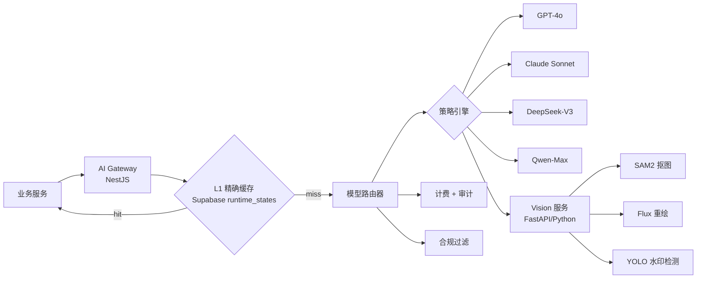
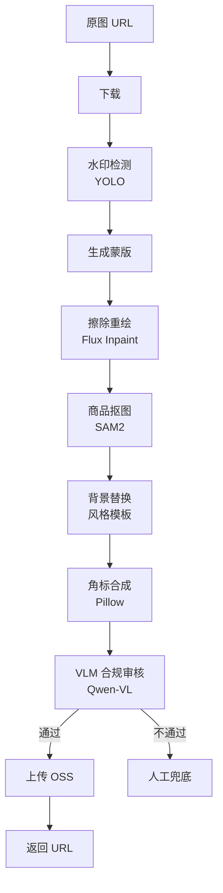

# AI 中台设计

> AI 中台是产品的核心壁垒。设计原则：**多模型路由 + 缓存 + 蒸馏**，把单店月 AI 成本压在订阅费的 20% 内。
>
> **当前实现边界（2026-08-08）**：L1 精确缓存已从 Redis 改为 Supabase PostgreSQL `runtime_states`，写入失败时仅在当前 BFF 进程内做内存降级；L2 Milvus 语义缓存与 L3 模板体系仍是目标设计，不得按已上线能力计入命中率或成本。第 45 个 migration 尚未应用到 staging（当前 43/45），所以该候选还不能在 staging 声称已验收。

## 1. 总体结构



## 2. 模型路由策略

### 2.1 按场景分配

| 场景                     | 主模型        | 备选        | 理由           |
| ------------------------ | ------------- | ----------- | -------------- |
| 标题生成（量大、低难度） | DeepSeek-V3   | Qwen-Plus   | 便宜，质量足够 |
| 详情页改写（中等难度）   | Qwen-Max      | DeepSeek-V3 | 中文创作好     |
| 推荐理由（要可解释）     | Claude Haiku  | GPT-4o-mini | 推理稳         |
| 合规审核（高准确）       | GPT-4o-mini   | Qwen-Max    | 严肃场景       |
| 客服对话（个性化）       | Claude Sonnet | GPT-4o      | 风格自然       |
| 视觉合规（VLM）          | Qwen-VL-Max   | GPT-4o      | 中文场景好     |

### 2.2 按用户等级分配

| Plan         | 默认路由               | 升级触发       |
| ------------ | ---------------------- | -------------- |
| Free / Basic | 国产模型为主           | —              |
| Pro          | 国产 + GPT-4o-mini     | 高难度任务升级 |
| Flagship     | GPT-4o / Claude Sonnet | 全场景         |

### 2.3 容灾与降级

```
主模型超时 / 限流 → 备选模型 → 降级到模板生成 → 返回失败
```

## 3. 三级缓存

| 层           | 实现状态                                                                  | 命中场景               |
| ------------ | ------------------------------------------------------------------------- | ---------------------- |
| L1：精确缓存 | 当前候选：`runtime_states` + `key=hash(prompt+model)`；失败时进程内存降级 | 完全相同请求           |
| L2：语义缓存 | 目标：Milvus / pgvector + 阈值 0.95；尚未接入                             | 改了几个字的同语义请求 |
| L3：模板缓存 | 目标：预生成类目模板；尚未形成可验收体系                                  | 冷启动时无 AI 调用     |

**规划假设，不是当前事实**：L1 30% + L2 25% + L3 15% = 70%。必须先通过真实流量建立逐层命中率与成本基线，不能用该假设宣称已经节省 70%。

## 4. Prompt 工程规范

### 4.1 模板结构

```yaml
name: title_generator_douyin
version: 1.2.0
model: deepseek-v3
temperature: 0.7
max_tokens: 200
system: |
  你是抖音小店标题优化专家。要求：
  1. 30 字以内
  2. 前 12 字必含核心关键词
  3. 禁用极限词、医疗用语
  4. 风格活泼，目标人群：18-35 岁女性
user: |
  原标题：{{original_title}}
  类目：{{category}}
  卖点：{{selling_points}}
  请生成 5 个候选标题，JSON 数组返回。
output_schema:
  type: array
  items:
    type: object
    properties:
      title: string
      keywords: array
      score: number
```

### 4.2 版本管理

- 每个 prompt 模板有版本号
- 灰度发布，A/B 对比效果（点击率/转化率）
- 自动回滚（关键指标下跌 > 10%）

## 5. 视觉处理流水线

### 5.1 主图处理流程



### 5.2 性能与成本

| 步骤     | 耗时    | 成本             |
| -------- | ------- | ---------------- |
| 水印检测 | 80ms    | 自部署 ≈ 0       |
| Inpaint  | 1.2s    | Flux GPU ≈ ¥0.02 |
| 抠图     | 200ms   | SAM2 ≈ ¥0.005    |
| 重绘背景 | 1.5s    | Flux ≈ ¥0.02     |
| VLM 审核 | 600ms   | Qwen-VL ≈ ¥0.01  |
| **合计** | **~4s** | **~¥0.055/张**   |

异步队列 + 批量化后单图成本可压到 **¥0.03**。

### 5.3 GPU 部署

| 模型       | 显存 | 单卡 QPS | 配置       |
| ---------- | ---- | -------- | ---------- |
| Flux.1-dev | 24GB | 0.8      | A10 / 4090 |
| SAM2-Large | 8GB  | 5        | T4 即可    |
| Qwen-VL-7B | 16GB | 3        | A10        |

**初期方案**：4 卡 A10 + 弹性扩缩，月成本约 1.5 万。

## 6. 选品打分模型

### 6.1 特征工程

| 类别 | 特征                      | 来源            |
| ---- | ------------------------- | --------------- |
| 需求 | 抖音/小红书近 7/30 日热度 | 公开榜单 + 自采 |
| 需求 | 1688 同款月销趋势         | 1688 OpenAPI    |
| 竞争 | 淘宝同款数量、价格分布    | 自采            |
| 竞争 | 抖音同款达人数            | 自采            |
| 利润 | 1688 价格 vs 淘宝中位价   | 计算            |
| 利润 | 重量、体积、运费估算      | 1688 详情       |
| 合规 | 类目敏感度（食品/医疗等） | 规则库          |
| 合规 | 标题/详情敏感词命中       | 规则库          |
| 趋势 | 30 日增长率               | 时序计算        |

### 6.2 模型

```
v1: XGBoost 二分类 + 排序（爆款标签数据少，先用规则蒸馏）
v2: LightGBM Ranking（积累点击/铺货数据后）
v3: 多塔模型（用户嵌入 × 商品嵌入）
```

### 6.3 推荐解释

打分后调用 LLM 生成"为什么推荐"，从特征中挑 3 条最显著的转化为自然语言。

## 7. 合规过滤

### 7.1 文本合规

```
LLM 输出 → 敏感词库匹配（DFA）→ 极限词检测 → 类目违禁词 → 通过/替换/拒绝
```

敏感词库分类：

- 极限词（最/第一/国家级）
- 医疗用语（治疗/根治/疗效）
- 类目违禁（食品保健、化妆品功效等）
- 平台特定（抖音直播禁用词）

### 7.2 图像合规

- 水印 / Logo / 二维码检测
- 文字 OCR + 敏感词
- 商品类目与图片一致性 VLM 校验

## 8. 计费与限流

### 8.1 计费

每次 LLM 调用记录到 `ai_usage_logs`：

- 输入/输出 token
- 模型单价
- 用户、模块、trace_id
- 实时累计到日维度

### 8.2 限流

| 维度   | 策略                        |
| ------ | --------------------------- |
| 用户级 | 滑动窗口（按 plan 分级）    |
| 模块级 | Free 用户每天 50 次标题生成 |
| 全局   | 单模型 QPS 保护             |

当前平台 AI 月度额度由 PostgreSQL 中的用量记录与 Serializable 预占事务执行，不依赖本机中间件。`runtime_states` 的 fixed-window 计数当前用于 1688 全局货源采集限流，不应误写成 AI 计费账本；AI 精确缓存可丢弃，已计费结果与额度状态不可只存在于短期状态表。

## 9. 可观测性

| 指标          | 监控              |
| ------------- | ----------------- |
| 模型成功率    | < 95% 告警        |
| 模型 P99 延迟 | > 5s 告警         |
| 缓存命中率    | < 50% 告警        |
| 单店月成本    | > 订阅费 25% 告警 |
| 合规拦截率    | 突变告警          |

## 10. 演进路径

- **Phase 1**：API 直调 + Prompt 工程
- **Phase 2**：缓存 + 路由 + 计费
- **Phase 3**：用业务数据微调小模型（Qwen-1.5B/3B）替换部分场景，成本再降 60%
- **Phase 4**：自训练垂直模型（标题、详情、主图重绘）
